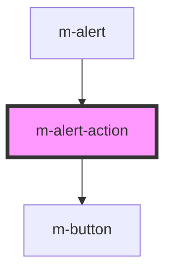

# m-alert-action

<!-- Auto Generated Below -->

## Properties

| Property              | Attribute | Description                                       | Type          | Default     |
| --------------------- | --------- | ------------------------------------------------- | ------------- | ----------- |
| `action` _(required)_ | --        | The action to perform when the button is clicked. | `AlertAction` | `undefined` |

## Events

| Event      | Description                                | Type                       |
| ---------- | ------------------------------------------ | -------------------------- |
| `modClick` | Emitted when the action button is clicked. | `CustomEvent<AlertAction>` |

## Dependencies

### Used by

 - [m-alert](../m-alert)

### Depends on

- [m-button](../m-button)

### Graph

----------------------------------------------

*Built with [StencilJS](https://stenciljs.com/)*
