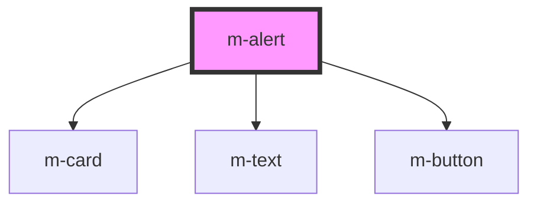

# m-alert

<!-- Auto Generated Below -->

## Properties

| Property  | Attribute | Description | Type            | Default     |
| --------- | --------- | ----------- | --------------- | ----------- |
| `actions` | --        |             | `AlertAction[]` | `[]`        |
| `body`    | `body`    |             | `string`        | `''`        |
| `header`  | `header`  |             | `string`        | `''`        |
| `theme`   | `theme`   |             | `string`        | `'primary'` |

## Events

| Event            | Description | Type                       |
| ---------------- | ----------- | -------------------------- |
| `modActionClick` |             | `CustomEvent<AlertAction>` |

## Shadow Parts

| Part     | Description |
| -------- | ----------- |
| `"card"` |             |

## Dependencies

### Depends on

- [m-card](../m-card)
- [m-text](../m-text)
- [m-button](../m-button)

### Graph

----------------------------------------------

*Built with [StencilJS](https://stenciljs.com/)*
