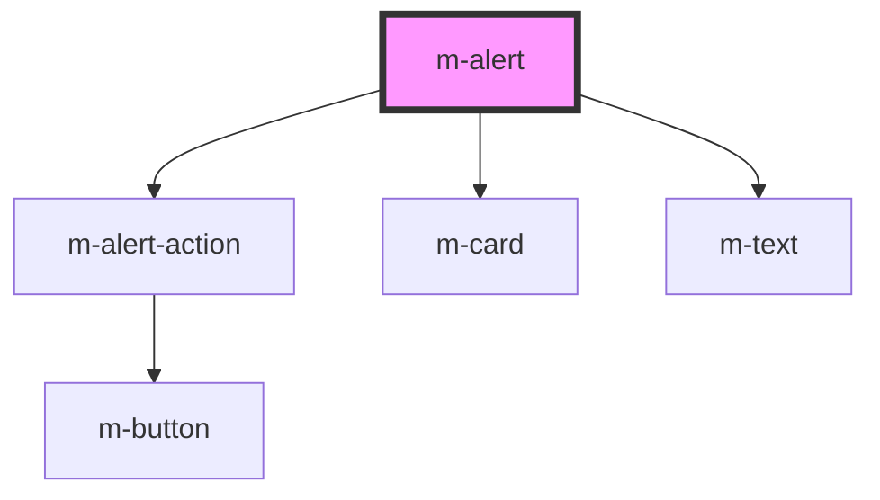

# m-alert

<!-- Auto Generated Below -->

## Properties

| Property  | Attribute | Description                                 | Type            | Default     |
| --------- | --------- | ------------------------------------------- | --------------- | ----------- |
| `actions` | --        | the action buttons                          | `AlertAction[]` | `[]`        |
| `body`    | `body`    | the body of alert render on top of the slot | `string`        | `''`        |
| `header`  | `header`  | The header text                             | `string`        | `''`        |
| `theme`   | `theme`   | The theme to use.                           | `string`        | `'primary'` |

## Events

| Event            | Description                                | Type                       |
| ---------------- | ------------------------------------------ | -------------------------- |
| `modActionClick` | Emitted when the action button is clicked. | `CustomEvent<AlertAction>` |

## Shadow Parts

| Part     | Description |
| -------- | ----------- |
| `"card"` |             |

## Dependencies

### Depends on

- [m-alert-action](../m-alert-action)
- [m-card](../m-card)
- [m-text](../m-text)

### Graph

----------------------------------------------

*Built with [StencilJS](https://stenciljs.com/)*
