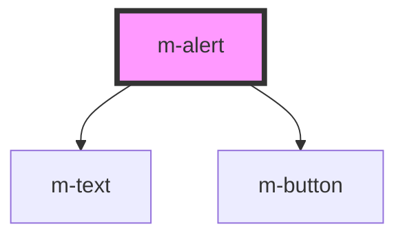

# m-alert

<!-- Auto Generated Below -->

## Properties

| Property  | Attribute | Description | Type            | Default |
| --------- | --------- | ----------- | --------------- | ------- |
| `actions` | --        |             | `AlertAction[]` | `[]`    |
| `body`    | `body`    |             | `string`        | `''`    |
| `header`  | `header`  |             | `string`        | `''`    |

## Events

| Event            | Description | Type                       |
| ---------------- | ----------- | -------------------------- |
| `modActionClick` |             | `CustomEvent<AlertAction>` |

## Dependencies

### Depends on

- [m-text](../m-text)
- [m-button](../m-button)

### Graph

----------------------------------------------

*Built with [StencilJS](https://stenciljs.com/)*
