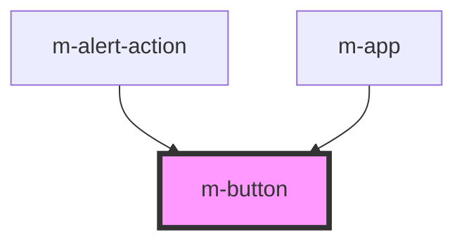

# m-button

<!-- Auto Generated Below -->

## Properties

| Property   | Attribute  | Description                        | Type                              | Default    |
| ---------- | ---------- | ---------------------------------- | --------------------------------- | ---------- |
| `disabled` | `disabled` | Flag to disable the button.        | `boolean`                         | `false`    |
| `text`     | `text`     | The text to display in the button. | `string`                          | `''`       |
| `type`     | `type`     | The type of the button.            | `"button" \| "reset" \| "submit"` | `'button'` |

## Events

| Event            | Description                               | Type               |
| ---------------- | ----------------------------------------- | ------------------ |
| `modButtonClick` | Emitted when the button has been clicked. | `CustomEvent<any>` |

## Shadow Parts

| Part       | Description |
| ---------- | ----------- |
| `"button"` |             |

## Dependencies

### Used by

 - [m-alert-action](../m-alert-action)
 - [m-app](../m-app)

### Graph

----------------------------------------------

*Built with [StencilJS](https://stenciljs.com/)*
