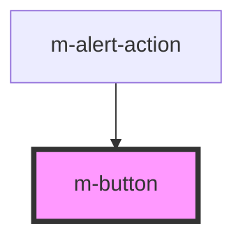

# m-button

<!-- Auto Generated Below -->

## Properties

| Property  | Attribute | Description                       | Type                                                        | Default     |
| --------- | --------- | --------------------------------- | ----------------------------------------------------------- | ----------- |
| `mType`   | `m-type`  | The type of the button.           | `"button" \| "reset" \| "submit"`                           | `'button'`  |
| `mValue`  | `m-value` | The value of the button.          | `string`                                                    | `''`        |
| `outline` | `outline` | Flag to display outline button.   | `boolean`                                                   | `false`     |
| `state`   | `state`   | Flag to set the button as active. | `"active" \| "disabled" \| "focus" \| "hover" \| undefined` | `undefined` |
| `text`    | `text`    | The text to display.              | `string`                                                    | `''`        |
| `theme`   | `theme`   | The theme to use.                 | `string`                                                    | `'primary'` |
| `variant` | `variant` | The variant to use.               | `"block" \| "ghost" \| "pill" \| "text"`                    | `'pill'`    |

## Events

| Event          | Description                               | Type               |
| -------------- | ----------------------------------------- | ------------------ |
| `mButtonClick` | Emitted when the button has been clicked. | `CustomEvent<any>` |

## Dependencies

### Used by

 - [m-alert-action](../m-alert-action)

### Graph

----------------------------------------------

*Built with [StencilJS](https://stenciljs.com/)*
