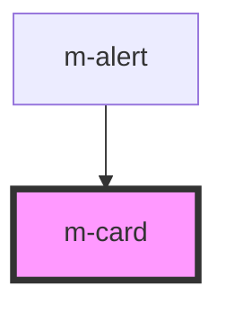

# m-card

<!-- Auto Generated Below -->

## Properties

| Property   | Attribute  | Description | Type                  | Default     |
| ---------- | ---------- | ----------- | --------------------- | ----------- |
| `disabled` | `disabled` |             | `boolean`             | `false`     |
| `header`   | `header`   |             | `string \| undefined` | `undefined` |
| `theme`    | `theme`    |             | `string`              | `'primary'` |

## Events

| Event            | Description | Type               |
| ---------------- | ----------- | ------------------ |
| `modButtonClick` |             | `CustomEvent<any>` |

## Shadow Parts

| Part            | Description |
| --------------- | ----------- |
| `"card"`        |             |
| `"card-body"`   |             |
| `"card-header"` |             |

## Dependencies

### Used by

 - [m-alert](../m-alert)

### Graph

----------------------------------------------

*Built with [StencilJS](https://stenciljs.com/)*
