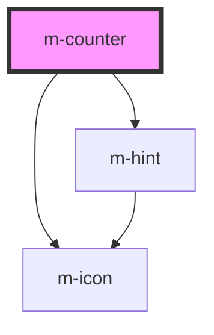

# m-counter

<!-- Auto Generated Below -->

## Properties

| Property             | Attribute          | Description                                                          | Type                         | Default      |
| -------------------- | ------------------ | -------------------------------------------------------------------- | ---------------------------- | ------------ |
| `disabled`           | `disabled`         | Change the layout direction to put the label on top or left of input | `boolean`                    | `false`      |
| `hint`               | `hint`             | Id of the input                                                      | `string \| undefined`        | `undefined`  |
| `hintIconEnd`        | `hint-icon-end`    | Id of the input                                                      | `string \| undefined`        | `undefined`  |
| `hintIconStart`      | `hint-icon-start`  | Id of the input                                                      | `string \| undefined`        | `undefined`  |
| `label`              | `label`            | Id of the input                                                      | `string \| undefined`        | `undefined`  |
| `layoutDirection`    | `layout-direction` | Change the layout direction to put the label on top or left of input | `"horizontal" \| "vertical"` | `'vertical'` |
| `mId` _(required)_   | `m-id`             | Id of the input                                                      | `string`                     | `undefined`  |
| `max` _(required)_   | `max`              | Id of the input                                                      | `number`                     | `undefined`  |
| `min` _(required)_   | `min`              | Id of the input                                                      | `number`                     | `undefined`  |
| `theme`              | `theme`            | Id of the input                                                      | `string`                     | `'info'`     |
| `value` _(required)_ | `value`            | Id of the input                                                      | `number`                     | `undefined`  |
| `variant`            | `variant`          | Id of the input                                                      | `"default" \| "prime"`       | `'default'`  |

## Events

| Event    | Description              | Type               |
| -------- | ------------------------ | ------------------ |
| `mClick` | Event for button pressed | `CustomEvent<any>` |
| `mInput` | Event for input change   | `CustomEvent<any>` |

## Dependencies

### Depends on

- [m-icon](../m-icon)
- [m-hint](../m-hint)

### Graph

----------------------------------------------

*Built with [StencilJS](https://stenciljs.com/)*
