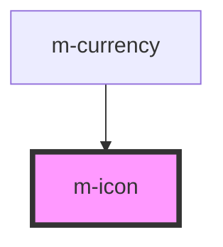

# m-icon

<!-- Auto Generated Below -->

## Properties

| Property            | Attribute    | Description                         | Type                  | Default     |
| ------------------- | ------------ | ----------------------------------- | --------------------- | ----------- |
| `duration`          | `duration`   | Loading animation duration          | `number`              | `1.8`       |
| `icon` _(required)_ | `icon`       | Name of icon to use (in kebab-case) | `string`              | `undefined` |
| `isLoading`         | `is-loading` | Is loading                          | `boolean`             | `false`     |
| `size`              | `size`       | Font size of the icon               | `string \| undefined` | `'inherit'` |
| `theme`             | `theme`      | Theme of the icon                   | `string \| undefined` | `undefined` |

## Dependencies

### Used by

 - [m-currency](../m-currency)

### Graph

----------------------------------------------

*Built with [StencilJS](https://stenciljs.com/)*
