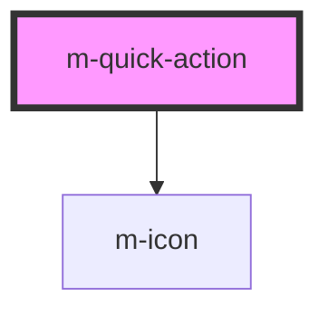

# m-quick-action

<!-- Auto Generated Below -->

## Properties

| Property            | Attribute     | Description                          | Type                                            | Default           |
| ------------------- | ------------- | ------------------------------------ | ----------------------------------------------- | ----------------- |
| `actionIcon`        | `action-icon` | The action icon for the quick action | `string \| undefined`                           | `'chevron-right'` |
| `actionWord`        | `action-word` | The action word for the quick action | `string \| undefined`                           | `undefined`       |
| `extraInfo`         | `extra-info`  | The extra info of the quick action   | `string \| undefined`                           | `undefined`       |
| `icon`              | `icon`        | The icon of the quick action         | `string \| undefined`                           | `'heart-fill'`    |
| `image`             | `image`       | The image of the quick action        | `string \| undefined`                           | `undefined`       |
| `state`             | `state`       | The state of the quick action        | `"disabled" \| "focus" \| "hover" \| undefined` | `undefined`       |
| `subtext`           | `subtext`     | The subtext of the quick action      | `string \| undefined`                           | `undefined`       |
| `text` _(required)_ | `text`        | The main text of the quick action    | `string`                                        | `undefined`       |
| `variant`           | `variant`     | The variant of the quick action      | `"compact" \| "extended" \| undefined`          | `'extended'`      |

## Events

| Event    | Description                              | Type               |
| -------- | ---------------------------------------- | ------------------ |
| `mClick` | Emitted when the input value has changed | `CustomEvent<any>` |

## Dependencies

### Depends on

- [m-icon](../m-icon)

### Graph

----------------------------------------------

*Built with [StencilJS](https://stenciljs.com/)*
