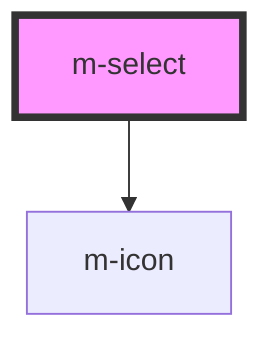

# m-select

<!-- Auto Generated Below -->

## Properties

| Property           | Attribute          | Description                                                           | Type                                 | Default         |
| ------------------ | ------------------ | --------------------------------------------------------------------- | ------------------------------------ | --------------- |
| `hint`             | `hint`             | The hint of the select in full variant                                | `string \| undefined`                | `undefined`     |
| `hintIcon`         | `hint-icon`        | The hint icon for the select in full variant                          | `string \| undefined`                | `'emoji-smile'` |
| `iconEnd`          | `icon-end`         | The end icon for the select                                           | `string \| undefined`                | `undefined`     |
| `iconMiddle`       | `icon-middle`      | The middle icon for the select                                        | `string \| undefined`                | `undefined`     |
| `iconStart`        | `icon-start`       | The start icon for the select                                         | `string \| undefined`                | `undefined`     |
| `label`            | `label`            | The label of the select in full variant                               | `string \| undefined`                | `undefined`     |
| `layoutDirection`  | `layout-direction` | Change the layout direction to put the label on top or left of select | `"horizontal" \| "vertical"`         | `'vertical'`    |
| `mId` _(required)_ | `m-id`             | Id of the select                                                      | `string`                             | `undefined`     |
| `theme`            | `theme`            | The theme of the select                                               | `string`                             | `'tertiary'`    |
| `variant`          | `variant`          | The variant of the select                                             | `"full" \| "prime" \| "transparent"` | `'prime'`       |

## Events

| Event     | Description                               | Type                  |
| --------- | ----------------------------------------- | --------------------- |
| `mChange` | Emitted when the select value has changed | `CustomEvent<string>` |

## Dependencies

### Depends on

- [m-icon](../m-icon)

### Graph

----------------------------------------------

*Built with [StencilJS](https://stenciljs.com/)*
