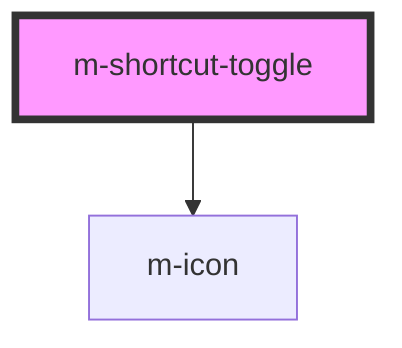

# m-shortcut-toogle

<!-- Auto Generated Below -->

## Properties

| Property             | Attribute    | Description              | Type                                                        | Default     |
| -------------------- | ------------ | ------------------------ | ----------------------------------------------------------- | ----------- |
| `icon`               | `icon`       | Shortcut icon            | `string \| undefined`                                       | `undefined` |
| `isChecked`          | `is-checked` | Is checked               | `boolean \| undefined`                                      | `undefined` |
| `label`              | `label`      | Shortcut label           | `string \| undefined`                                       | `undefined` |
| `mId` _(required)_   | `m-id`       | Id of the input          | `string`                                                    | `undefined` |
| `name` _(required)_  | `name`       | Name of the input        | `string`                                                    | `undefined` |
| `state`              | `state`      | Input and shortcut state | `"active" \| "disabled" \| "focus" \| "hover" \| undefined` | `undefined` |
| `text`               | `text`       | Shortcut text            | `string \| undefined`                                       | `undefined` |
| `value` _(required)_ | `value`      | Input value              | `string`                                                    | `undefined` |
| `white`              | `white`      | Theme                    | `boolean`                                                   | `false`     |

## Events

| Event     | Description                               | Type                  |
| --------- | ----------------------------------------- | --------------------- |
| `mChange` | Emitted when the select value has changed | `CustomEvent<string>` |

## Dependencies

### Depends on

- [m-icon](../m-icon)

### Graph

----------------------------------------------

*Built with [StencilJS](https://stenciljs.com/)*
