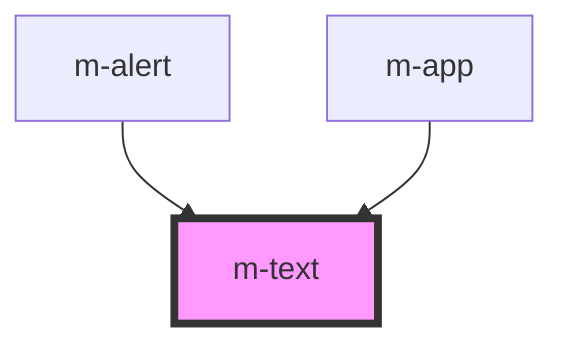

# m-text

<!-- Auto Generated Below -->

## Properties

| Property | Attribute | Description | Type     | Default  |
| -------- | --------- | ----------- | -------- | -------- |
| `theme`  | `theme`   |             | `string` | `'dark'` |

## Dependencies

### Used by

 - [m-alert](../m-alert)
 - [m-app](../m-app)

### Graph

----------------------------------------------

*Built with [StencilJS](https://stenciljs.com/)*
