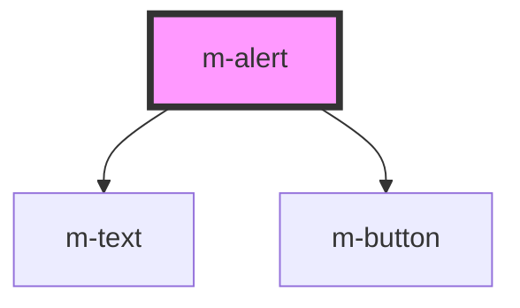

# m-alert

<!-- Auto Generated Below -->

## Properties

| Property  | Attribute | Description | Type            | Default     |
| --------- | --------- | ----------- | --------------- | ----------- |
| `actions` | --        |             | `AlertAction[]` | `[]`        |
| `body`    | `body`    |             | `string`        | `undefined` |
| `title`   | `title`   |             | `string`        | `undefined` |

## Events

| Event         | Description | Type                                         |
| ------------- | ----------- | -------------------------------------------- |
| `actionClick` |             | `CustomEvent<{ id: string; text: string; }>` |

## Dependencies

### Depends on

- [m-text](../m-text)
- [m-button](../m-button)

### Graph

----------------------------------------------

*Built with [StencilJS](https://stenciljs.com/)*
