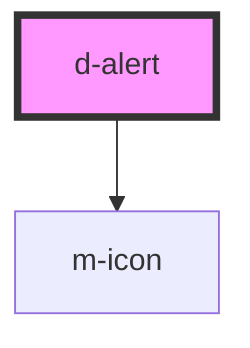

# d-alert

<!-- Auto Generated Below -->

## Properties

| Property           | Attribute            | Description             | Type                                                                | Default     |
| ------------------ | -------------------- | ----------------------- | ------------------------------------------------------------------- | ----------- |
| `icon`             | `icon`               | Alert icon              | `string \| undefined`                                               | `undefined` |
| `iconFamilyClass`  | `icon-family-class`  | Right icon family class | `string \| undefined`                                               | `undefined` |
| `iconFamilyPrefix` | `icon-family-prefix` | Right icon family class | `string \| undefined`                                               | `undefined` |
| `showClose`        | `show-close`         | Show close button       | `boolean \| undefined`                                              | `undefined` |
| `showIcon`         | `show-icon`          | Show alert icon         | `boolean`                                                           | `false`     |
| `type`             | `type`               | Alert type              | `"danger" \| "dark" \| "info" \| "light" \| "success" \| "warning"` | `'light'`   |

## Events

| Event        | Description                               | Type               |
| ------------ | ----------------------------------------- | ------------------ |
| `eventClose` | Emitted when the button has been clicked. | `CustomEvent<any>` |

## Dependencies

### Depends on

- [m-icon](../m-icon)

### Graph

----------------------------------------------

*Built with [StencilJS](https://stenciljs.com/)*
