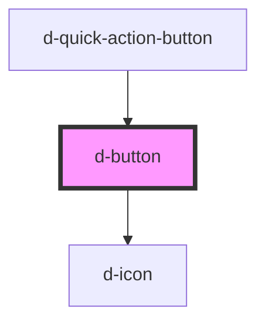

# d-button

<!-- Auto Generated Below -->

## Properties

| Property                | Attribute                  | Description                                          | Type                                                                | Default     |
| ----------------------- | -------------------------- | ---------------------------------------------------- | ------------------------------------------------------------------- | ----------- |
| `iconEnd`               | `icon-end`                 | Icon right to display                                | `string \| undefined`                                               | `undefined` |
| `iconEndFamilyClass`    | `icon-end-family-class`    | Icon right family class                              | `string \| undefined`                                               | `undefined` |
| `iconEndFamilyPrefix`   | `icon-end-family-prefix`   | Icon right family prefix                             | `string \| undefined`                                               | `undefined` |
| `iconStart`             | `icon-start`               | Icon left to display                                 | `string \| undefined`                                               | `undefined` |
| `iconStartFamilyClass`  | `icon-start-family-class`  | Icon left family class                               | `string \| undefined`                                               | `undefined` |
| `iconStartFamilyPrefix` | `icon-start-family-prefix` | Icon left family prefix                              | `string \| undefined`                                               | `undefined` |
| `isDisabled`            | `is-disabled`              | Flag to disable the button, alias to state="disable" | `boolean`                                                           | `false`     |
| `isLoading`             | `is-loading`               | Flag to loading state and disable button.            | `boolean`                                                           | `false`     |
| `isPill`                | `is-pill`                  | Flag to switch to pill button border radius.         | `boolean`                                                           | `false`     |
| `size`                  | `size`                     | The size                                             | `"lg" \| "sm" \| undefined`                                         | `undefined` |
| `state`                 | `state`                    | Change the state of the button                       | `"active" \| "disabled" \| "focus-visible" \| "hover" \| undefined` | `undefined` |
| `text`                  | `text`                     | The text to display.                                 | `string`                                                            | `''`        |
| `theme`                 | `theme`                    | Theme to use.                                        | `string`                                                            | `'primary'` |
| `type`                  | `type`                     | The html type of the button.                         | `"button" \| "reset" \| "submit"`                                   | `'button'`  |
| `value`                 | `value`                    | The html value of the button.                        | `string \| undefined`                                               | `undefined` |
| `variant`               | `variant`                  | The variant to use.                                  | `"link" \| "outline" \| undefined`                                  | `undefined` |

## Events

| Event        | Description                               | Type               |
| ------------ | ----------------------------------------- | ------------------ |
| `eventClick` | Emitted when the button has been clicked. | `CustomEvent<any>` |

## Dependencies

### Used by

 - [d-quick-action-button](../d-quick-action-button)

### Depends on

- [d-icon](../d-icon)

### Graph

----------------------------------------------

*Built with [StencilJS](https://stenciljs.com/)*
