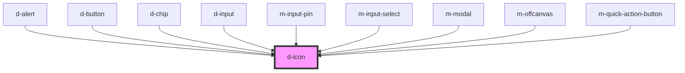

# d-icon

<!-- Auto Generated Below -->

## Properties

| Property            | Attribute          | Description                                        | Type                  | Default                                              |
| ------------------- | ------------------ | -------------------------------------------------- | --------------------- | ---------------------------------------------------- |
| `backgroundColor`   | `background-color` | Icon background color in css color unit or var     | `string \| undefined` | `undefined`                                          |
| `circleSize`        | `circle-size`      | Circle size in css length unit                     | `string \| undefined` | ``calc(var(--${PREFIX_BS}icon-component-size) * 1)`` |
| `color`             | `color`            | Icon color in css color unit or var                | `string \| undefined` | `undefined`                                          |
| `familyClass`       | `family-class`     | Change the family class to use another icon suite  | `string \| undefined` | `state.iconFamilyClass`                              |
| `familyPrefix`      | `family-prefix`    | Change the family prefix to use another icon suite | `string \| undefined` | `state.iconFamilyPrefix`                             |
| `hasCircle`         | `has-circle`       | Add circle around the icon                         | `boolean`             | `false`                                              |
| `icon` _(required)_ | `icon`             | Name of icon to use (in kebab-case)                | `string`              | `undefined`                                          |
| `innerClass`        | `inner-class`      | Icon class                                         | `string \| undefined` | `undefined`                                          |
| `isLoading`         | `is-loading`       | Enable loading animation                           | `boolean`             | `false`                                              |
| `loadingDuration`   | `loading-duration` | Loading animation duration, in seconds             | `number`              | `1.8`                                                |
| `size`              | `size`             | Size of the icon in css length unit                | `string \| undefined` | `'1.5rem'`                                           |
| `theme`             | `theme`            | Theme of the icon                                  | `string \| undefined` | `undefined`                                          |

## Dependencies

### Used by

 - [d-alert](../d-alert)
 - [d-button](../d-button)
 - [d-chip](../d-chip)
 - [d-input](../d-input)
 - [m-input-pin](../m-input-pin)
 - [m-input-select](../m-input-select)
 - [m-modal](../m-modal)
 - [m-offcanvas](../m-offcanvas)
 - [m-quick-action-button](../m-quick-action-button)

### Graph

----------------------------------------------

*Built with [StencilJS](https://stenciljs.com/)*
