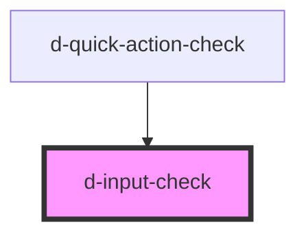

# d-form-check

<!-- Auto Generated Below -->

## Properties

| Property               | Attribute          | Description                                                   | Type                    | Default     |
| ---------------------- | ------------------ | ------------------------------------------------------------- | ----------------------- | ----------- |
| `innerId` _(required)_ | `inner-id`         | Form control identifier                                       | `string`                | `undefined` |
| `isChecked`            | `is-checked`       | Set checkbox or radio button marked as selected or not        | `boolean`               | `false`     |
| `isDisabled`           | `is-disabled`      | Set input as disabled                                         | `boolean`               | `false`     |
| `isIndeterminate`      | `is-indeterminate` | Set view of checkbox as indeterminated                        | `boolean \| undefined`  | `undefined` |
| `label`                | `label`            | Text that will be displayed beside Check input or Radio input | `string \| undefined`   | `undefined` |
| `name`                 | `name`             | HTML Name to use within a form or JS reference                | `string \| undefined`   | `undefined` |
| `type` _(required)_    | `type`             | Set whether is a checkbox input or a radio input              | `"checkbox" \| "radio"` | `undefined` |
| `value`                | `value`            | A string representing the value of the checkbox or radio      | `string \| undefined`   | `undefined` |

## Events

| Event         | Description                         | Type               |
| ------------- | ----------------------------------- | ------------------ |
| `eventChange` | Emitted when the switch has changed | `CustomEvent<any>` |

## Dependencies

### Used by

 - [d-quick-action-check](../d-quick-action-check)

### Graph

----------------------------------------------

*Built with [StencilJS](https://stenciljs.com/)*
