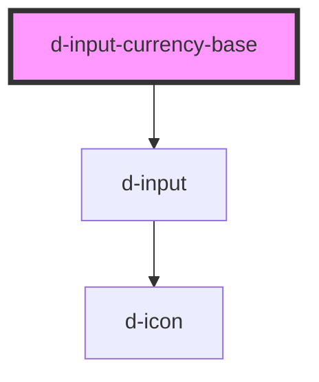

# d-currency-base

<!-- Auto Generated Below -->

## Properties

| Property                       | Attribute                  | Description                           | Type                  | Default     |
| ------------------------------ | -------------------------- | ------------------------------------- | --------------------- | ----------- |
| `currencyCode`                 | `currency-code`            | Currency code                         | `string \| undefined` | `undefined` |
| `currencyOptions` _(required)_ | --                         | Options for the d-input-currency-base | `Options`             | `undefined` |
| `hint`                         | `hint`                     | Hint to display                       | `string \| undefined` | `undefined` |
| `iconEnd`                      | `icon-end`                 | Icon for the end                      | `string \| undefined` | `undefined` |
| `iconEndFamilyClass`           | `icon-end-family-class`    | Right icon family class               | `string \| undefined` | `undefined` |
| `iconEndFamilyPrefix`          | `icon-end-family-prefix`   | Right icon family class               | `string \| undefined` | `undefined` |
| `iconFamilyClass`              | `icon-family-class`        | Right icon family class               | `string \| undefined` | `undefined` |
| `iconFamilyPrefix`             | `icon-family-prefix`       | Right icon family class               | `string \| undefined` | `undefined` |
| `iconStart`                    | `icon-start`               | Icon for the left                     | `string \| undefined` | `undefined` |
| `iconStartFamilyClass`         | `icon-start-family-class`  | Left icon family class                | `string \| undefined` | `undefined` |
| `iconStartFamilyPrefix`        | `icon-start-family-prefix` | Left icon family class                | `string \| undefined` | `undefined` |
| `innerId` _(required)_         | `inner-id`                 | The id of the input                   | `string`              | `undefined` |
| `isDisabled`                   | `is-disabled`              | The input is disabled                 | `boolean`             | `false`     |
| `isInvalid`                    | `is-invalid`               | Add is-invalid class                  | `boolean`             | `false`     |
| `isLoading`                    | `is-loading`               | Flag for loading state.               | `boolean`             | `false`     |
| `isReadOnly`                   | `is-read-only`             | Flag to read only the input           | `boolean`             | `false`     |
| `isValid`                      | `is-valid`                 | Add is-valid class                    | `boolean`             | `false`     |
| `label`                        | `label`                    | The label text                        | `string`              | `''`        |
| `labelIcon`                    | `label-icon`               | Icon for the label text               | `string \| undefined` | `undefined` |
| `labelIconFamilyClass`         | `label-icon-family-class`  | Icon label family class               | `string \| undefined` | `undefined` |
| `labelIconFamilyPrefix`        | `label-icon-family-prefix` | Icon label family class               | `string \| undefined` | `undefined` |
| `maxValue`                     | `max-value`                | * The max value of the input          | `number \| undefined` | `undefined` |
| `minValue`                     | `min-value`                | * The min value of the input          | `number \| undefined` | `undefined` |
| `name`                         | `name`                     | The name of the input                 | `string \| undefined` | `undefined` |
| `placeholder`                  | `placeholder`              | Placeholder for the input             | `string \| undefined` | `''`        |
| `value`                        | `value`                    | The value of the input                | `number \| undefined` | `undefined` |

## Events

| Event         | Description                    | Type                  |
| ------------- | ------------------------------ | --------------------- |
| `eventBlur`   | Emitted when the inputs bur    | `CustomEvent<number>` |
| `eventChange` | Emitted when the inputs change | `CustomEvent<number>` |
| `eventFocus`  | Emitted when the inputs focus  | `CustomEvent<number>` |

## Dependencies

### Depends on

- [d-input](../d-input)

### Graph

----------------------------------------------

*Built with [StencilJS](https://stenciljs.com/)*
