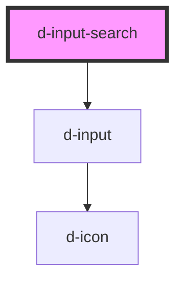

# d-input-search

<!-- Auto Generated Below -->

## Properties

| Property                | Attribute                  | Description                                             | Type                  | Default     |
| ----------------------- | -------------------------- | ------------------------------------------------------- | --------------------- | ----------- |
| `hint`                  | `hint`                     | Hint to display, also used to display validity feedback | `string \| undefined` | `undefined` |
| `innerId` _(required)_  | `inner-id`                 | The id of the input                                     | `string`              | `undefined` |
| `isDisabled`            | `is-disabled`              | Flag to disable the input                               | `boolean`             | `false`     |
| `isInvalid`             | `is-invalid`               | Add is-invalid class                                    | `boolean`             | `false`     |
| `isLoading`             | `is-loading`               | Flag for loading state.                                 | `boolean`             | `false`     |
| `isReadOnly`            | `is-read-only`             | Flag to read only the input                             | `boolean`             | `false`     |
| `isValid`               | `is-valid`                 | Add is-valid class                                      | `boolean`             | `false`     |
| `label`                 | `label`                    | The label text                                          | `string`              | `''`        |
| `labelIcon`             | `label-icon`               | Icon to display on label right                          | `string \| undefined` | `undefined` |
| `labelIconFamilyClass`  | `label-icon-family-class`  | Icon label family class                                 | `string \| undefined` | `undefined` |
| `labelIconFamilyPrefix` | `label-icon-family-prefix` | Icon label family class                                 | `string \| undefined` | `undefined` |
| `name`                  | `name`                     | The name of the input                                   | `string \| undefined` | `undefined` |
| `placeholder`           | `placeholder`              | The placeholder text                                    | `string`              | `''`        |
| `value`                 | `value`                    | The value of the input                                  | `string`              | `''`        |

## Events

| Event         | Description                              | Type                  |
| ------------- | ---------------------------------------- | --------------------- |
| `eventChange` | Emitted when the input value has changed | `CustomEvent<string>` |
| `eventClick`  | Emitted when the button is clicked       | `CustomEvent<string>` |

## Dependencies

### Depends on

- [d-input](../d-input)

### Graph

----------------------------------------------

*Built with [StencilJS](https://stenciljs.com/)*
