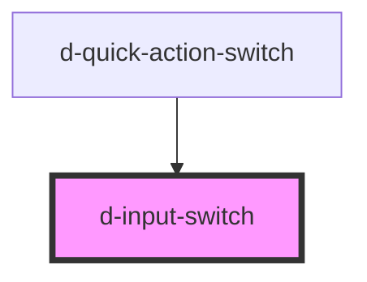

# d-input-switch

<!-- Auto Generated Below -->

## Properties

| Property               | Attribute     | Description                         | Type                   | Default     |
| ---------------------- | ------------- | ----------------------------------- | ---------------------- | ----------- |
| `innerId` _(required)_ | `inner-id`    | Id                                  | `string`               | `undefined` |
| `isChecked`            | `is-checked`  | Flag to change the check state      | `boolean \| undefined` | `undefined` |
| `isDisabled`           | `is-disabled` | Flag to disable the input           | `boolean \| undefined` | `undefined` |
| `isReadonly`           | `is-readonly` | Flag to disable the onMChange event | `boolean \| undefined` | `undefined` |
| `label`                | `label`       | The text to display in the switch.  | `string \| undefined`  | `undefined` |
| `name`                 | `name`        | Id                                  | `string \| undefined`  | `undefined` |

## Events

| Event         | Description                         | Type                   |
| ------------- | ----------------------------------- | ---------------------- |
| `eventChange` | Emitted when the switch has changed | `CustomEvent<boolean>` |

## Dependencies

### Used by

 - [d-quick-action-switch](../d-quick-action-switch)

### Graph

----------------------------------------------

*Built with [StencilJS](https://stenciljs.com/)*
