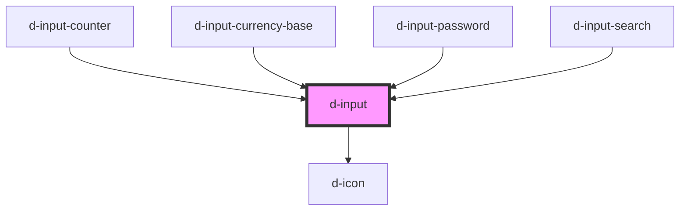

# d-input

<!-- Auto Generated Below -->

## Properties

| Property                | Attribute                  | Description                    | Type                  | Default     |
| ----------------------- | -------------------------- | ------------------------------ | --------------------- | ----------- |
| `hint`                  | `hint`                     | Hint to display                | `string \| undefined` | `undefined` |
| `iconEnd`               | `icon-end`                 | Icon to display on input right | `string \| undefined` | `undefined` |
| `iconEndFamilyClass`    | `icon-end-family-class`    | Right icon family class        | `string \| undefined` | `undefined` |
| `iconEndFamilyPrefix`   | `icon-end-family-prefix`   | Right icon family class        | `string \| undefined` | `undefined` |
| `iconFamilyClass`       | `icon-family-class`        | Right icon family class        | `string \| undefined` | `undefined` |
| `iconFamilyPrefix`      | `icon-family-prefix`       | Right icon family class        | `string \| undefined` | `undefined` |
| `iconStart`             | `icon-start`               | Icon to display on input left  | `string \| undefined` | `undefined` |
| `iconStartFamilyClass`  | `icon-start-family-class`  | Left icon family class         | `string \| undefined` | `undefined` |
| `iconStartFamilyPrefix` | `icon-start-family-prefix` | Left icon family class         | `string \| undefined` | `undefined` |
| `innerId` _(required)_  | `inner-id`                 | The id of the input            | `string`              | `undefined` |
| `innerInputMode`        | `inner-input-mode`         | Input mode                     | `string \| undefined` | `undefined` |
| `isDisabled`            | `is-disabled`              | Flag to disable the input      | `boolean`             | `false`     |
| `isInvalid`             | `is-invalid`               | Add is-invalid class           | `boolean`             | `false`     |
| `isLoading`             | `is-loading`               | Flag for loading state.        | `boolean`             | `false`     |
| `isReadOnly`            | `is-read-only`             | Flag to read only the input    | `boolean`             | `false`     |
| `isValid`               | `is-valid`                 | Add is-valid class             | `boolean`             | `false`     |
| `label`                 | `label`                    | The label text                 | `string`              | `''`        |
| `labelIcon`             | `label-icon`               | Icon for the label text        | `string \| undefined` | `undefined` |
| `labelIconFamilyClass`  | `label-icon-family-class`  | Icon label family class        | `string \| undefined` | `undefined` |
| `labelIconFamilyPrefix` | `label-icon-family-prefix` | Icon label family prefix       | `string \| undefined` | `undefined` |
| `name`                  | `name`                     | The name of the input          | `string \| undefined` | `undefined` |
| `pattern`               | `pattern`                  | Pattern to validate            | `string \| undefined` | `undefined` |
| `placeholder`           | `placeholder`              | The placeholder text           | `string`              | `''`        |
| `type`                  | `type`                     | The type of the input          | `string`              | `'text'`    |
| `value`                 | `value`                    | The value of the input         | `number \| string`    | `''`        |

## Events

| Event                 | Description                              | Type                            |
| --------------------- | ---------------------------------------- | ------------------------------- |
| `eventBlur`           | Emitted when blur the input              | `CustomEvent<any>`              |
| `eventChange`         | Emitted when the input value has changed | `CustomEvent<number \| string>` |
| `eventFocus`          | Emitted when blur the input              | `CustomEvent<any>`              |
| `eventIconEndClick`   | Emitted when click on the right icon     | `CustomEvent<MouseEvent>`       |
| `eventIconStartClick` | Emitted when click on the left icon      | `CustomEvent<MouseEvent>`       |
| `eventWheel`          | Emitted when blur the input              | `CustomEvent<any>`              |

## Methods

### `innerBlur() => Promise<void>`

Set blur to internal input

#### Returns

Type: `Promise<void>`

### `innerFocus() => Promise<void>`

Set focus to internal input

#### Returns

Type: `Promise<void>`

## Dependencies

### Used by

 - [d-input-counter](../d-input-counter)
 - [d-input-currency-base](../d-input-currency-base)
 - [d-input-password](../d-input-password)
 - [d-input-search](../d-input-search)

### Depends on

- [d-icon](../d-icon)

### Graph

----------------------------------------------

*Built with [StencilJS](https://stenciljs.com/)*
