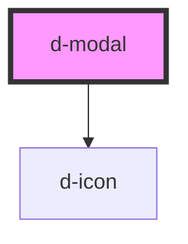

# d-modal

<!-- Auto Generated Below -->

## Properties

| Property                | Attribute                 | Description                          | Type                                                  | Default     |
| ----------------------- | ------------------------- | ------------------------------------ | ----------------------------------------------------- | ----------- |
| `footerActionPlacement` | `footer-action-placement` | Footer action direction              | `"center" \| "end" \| "fill" \| "start" \| undefined` | `'fill'`    |
| `fullScreenFrom`        | `full-screen-from`        | Minimum size to apply the fullscreen | `"lg" \| "md" \| "sm" \| "xl" \| "xxl" \| undefined`  | `undefined` |
| `isCentered`            | `is-centered`             | Is modal centered                    | `boolean \| undefined`                                | `undefined` |
| `isFullScreen`          | `is-full-screen`          | Is fullscreen in all sizes           | `boolean \| undefined`                                | `undefined` |
| `isScrollable`          | `is-scrollable`           | Is modal scrollable                  | `boolean \| undefined`                                | `undefined` |
| `isStatic`              | `is-static`               | Is backdrop static                   | `boolean \| undefined`                                | `undefined` |
| `modalSize`             | `modal-size`              | Modal size                           | `"lg" \| "sm" \| "xl" \| undefined`                   | `undefined` |
| `name` _(required)_     | `name`                    | the name of the modal                | `string`                                              | `undefined` |
| `showCloseButton`       | `show-close-button`       | No display close button              | `boolean \| undefined`                                | `undefined` |

## Events

| Event        | Description                              | Type                |
| ------------ | ---------------------------------------- | ------------------- |
| `eventClose` | Emitted when the input value has changed | `CustomEvent<void>` |

## Dependencies

### Depends on

- [d-icon](../d-icon)

### Graph

----------------------------------------------

*Built with [StencilJS](https://stenciljs.com/)*
