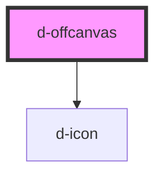

# d-offcanvas

<!-- Auto Generated Below -->

## Properties

| Property                | Attribute                 | Description                                  | Type                                                 | Default     |
| ----------------------- | ------------------------- | -------------------------------------------- | ---------------------------------------------------- | ----------- |
| `footerActionPlacement` | `footer-action-placement` | Footer action direction                      | `"end" \| "fill" \| "start" \| undefined`            | `'fill'`    |
| `isScrollable`          | `is-scrollable`           | Is body scrollable while offcanvas is active | `boolean \| undefined`                               | `undefined` |
| `isStatic`              | `is-static`               | Is backdrop static                           | `boolean \| undefined`                               | `undefined` |
| `name` _(required)_     | `name`                    | the name of the offcanvas                    | `string`                                             | `undefined` |
| `openFrom`              | `open-from`               | Position to show offcanvas from              | `"bottom" \| "end" \| "start" \| "top" \| undefined` | `'end'`     |
| `showCloseButton`       | `show-close-button`       | No display close button                      | `boolean \| undefined`                               | `undefined` |

## Events

| Event        | Description                              | Type                |
| ------------ | ---------------------------------------- | ------------------- |
| `eventClose` | Emitted when the input value has changed | `CustomEvent<void>` |

## Dependencies

### Depends on

- [d-icon](../d-icon)

### Graph

----------------------------------------------

*Built with [StencilJS](https://stenciljs.com/)*
