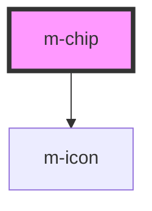

# m-chip

<!-- Auto Generated Below -->

## Properties

| Property           | Attribute            | Description                                        | Type                   | Default     |
| ------------------ | -------------------- | -------------------------------------------------- | ---------------------- | ----------- |
| `icon`             | `icon`               | Name of icon to use (in kebab-case)                | `string \| undefined`  | `undefined` |
| `iconFamilyClass`  | `icon-family-class`  | Change the family class to use another icon suite  | `string \| undefined`  | `undefined` |
| `iconFamilyPrefix` | `icon-family-prefix` | Change the family prefix to use another icon suite | `string \| undefined`  | `undefined` |
| `showClose`        | `show-close`         | Show close icon                                    | `boolean \| undefined` | `false`     |
| `text`             | `text`               | The text of badge                                  | `string \| undefined`  | `undefined` |
| `theme`            | `theme`              | The theme to use.                                  | `string`               | `'primary'` |

## Events

| Event    | Description                                     | Type               |
| -------- | ----------------------------------------------- | ------------------ |
| `mClose` | Emitted when the close button has been clicked. | `CustomEvent<any>` |

## Dependencies

### Depends on

- [m-icon](../m-icon)

### Graph

----------------------------------------------

*Built with [StencilJS](https://stenciljs.com/)*
