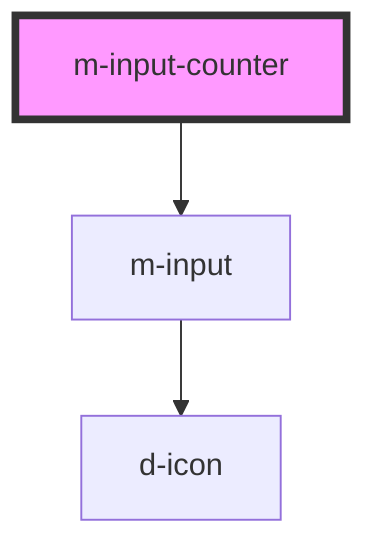

# m-input-counter

<!-- Auto Generated Below -->

## Properties

| Property                | Attribute                  | Description                  | Type                  | Default         |
| ----------------------- | -------------------------- | ---------------------------- | --------------------- | --------------- |
| `hint`                  | `hint`                     | Hint to display              | `string \| undefined` | `undefined`     |
| `iconEnd`               | `icon-end`                 | Icon for the end             | `string`              | `'plus-square'` |
| `iconEndFamilyClass`    | `icon-end-family-class`    | Right icon family class      | `string \| undefined` | `undefined`     |
| `iconEndFamilyPrefix`   | `icon-end-family-prefix`   | Right icon family class      | `string \| undefined` | `undefined`     |
| `iconFamilyClass`       | `icon-family-class`        | Right icon family class      | `string \| undefined` | `undefined`     |
| `iconFamilyPrefix`      | `icon-family-prefix`       | Right icon family class      | `string \| undefined` | `undefined`     |
| `iconStart`             | `icon-start`               | Icon for the left            | `string`              | `'dash-square'` |
| `iconStartFamilyClass`  | `icon-start-family-class`  | Left icon family class       | `string \| undefined` | `undefined`     |
| `iconStartFamilyPrefix` | `icon-start-family-prefix` | Left icon family class       | `string \| undefined` | `undefined`     |
| `isDisabled`            | `is-disabled`              | The input is disabled        | `boolean`             | `false`         |
| `isInvalid`             | `is-invalid`               | Add is-invalid class         | `boolean`             | `false`         |
| `isLoading`             | `is-loading`               | Flag for loading state.      | `boolean`             | `false`         |
| `isReadOnly`            | `is-read-only`             | Flag to read only the input  | `boolean`             | `false`         |
| `isValid`               | `is-valid`                 | Add is-valid class           | `boolean`             | `false`         |
| `label`                 | `label`                    | The label text               | `string`              | `''`            |
| `labelIcon`             | `label-icon`               | Icon for the label text      | `string \| undefined` | `undefined`     |
| `labelIconFamilyClass`  | `label-icon-family-class`  | Icon label family class      | `string \| undefined` | `undefined`     |
| `labelIconFamilyPrefix` | `label-icon-family-prefix` | Icon label family class      | `string \| undefined` | `undefined`     |
| `mId` _(required)_      | `m-id`                     | The id of the input          | `string`              | `undefined`     |
| `maxValue` _(required)_ | `max-value`                | * The max value of the input | `number`              | `undefined`     |
| `minValue` _(required)_ | `min-value`                | * The min value of the input | `number`              | `undefined`     |
| `name`                  | `name`                     | The name of the input        | `string \| undefined` | `undefined`     |
| `value` _(required)_    | `value`                    | The value of the input       | `number`              | `undefined`     |

## Events

| Event     | Description              | Type                  |
| --------- | ------------------------ | --------------------- |
| `mChange` | Event for input change   | `CustomEvent<number>` |
| `mClick`  | Event for button pressed | `CustomEvent<number>` |

## Dependencies

### Depends on

- [m-input](../m-input)

### Graph

----------------------------------------------

*Built with [StencilJS](https://stenciljs.com/)*
