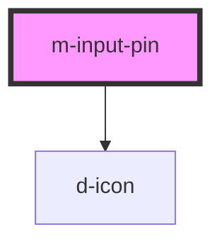

# m-pin

<!-- Auto Generated Below -->

## Properties

| Property                | Attribute                  | Description                     | Type                           | Default     |
| ----------------------- | -------------------------- | ------------------------------- | ------------------------------ | ----------- |
| `characters`            | `characters`               | Number of characters of the pin | `number`                       | `4`         |
| `hint`                  | `hint`                     | Hint for the m-coupon           | `string \| undefined`          | `undefined` |
| `iconFamilyClass`       | `icon-family-class`        | Right icon family class         | `string \| undefined`          | `undefined` |
| `iconFamilyPrefix`      | `icon-family-prefix`       | Right icon family class         | `string \| undefined`          | `undefined` |
| `isDisabled`            | `is-disabled`              | Flag to disable the input       | `boolean`                      | `false`     |
| `isInvalid`             | `is-invalid`               | Add is-invalid class            | `boolean`                      | `false`     |
| `isLoading`             | `is-loading`               | Flag for loading state.         | `boolean`                      | `false`     |
| `isReadOnly`            | `is-read-only`             | Flag to read only the input     | `boolean`                      | `false`     |
| `isSecret`              | `is-secret`                | Hide the characters             | `boolean`                      | `false`     |
| `isValid`               | `is-valid`                 | Add is-valid class              | `boolean`                      | `false`     |
| `label`                 | `label`                    | The label text                  | `string`                       | `''`        |
| `labelIcon`             | `label-icon`               | Icon for the label text         | `string \| undefined`          | `undefined` |
| `labelIconFamilyClass`  | `label-icon-family-class`  | Icon label family class         | `string \| undefined`          | `undefined` |
| `labelIconFamilyPrefix` | `label-icon-family-prefix` | Icon label family prefix        | `string \| undefined`          | `undefined` |
| `mId` _(required)_      | `m-id`                     | Id for the input                | `string`                       | `undefined` |
| `mInputMode`            | `m-input-mode`             | Keyboard style                  | `"numeric" \| "tel" \| "text"` | `'text'`    |
| `placeholder`           | `placeholder`              | Placeholder of the inputs       | `string \| undefined`          | `'•'`       |
| `type`                  | `type`                     | Type of the inputs              | `"number" \| "tel" \| "text"`  | `'text'`    |

## Events

| Event     | Description                         | Type                  |
| --------- | ----------------------------------- | --------------------- |
| `mChange` | Emitted when the inputs had changed | `CustomEvent<string>` |

## Dependencies

### Depends on

- [d-icon](../d-icon)

### Graph

----------------------------------------------

*Built with [StencilJS](https://stenciljs.com/)*
