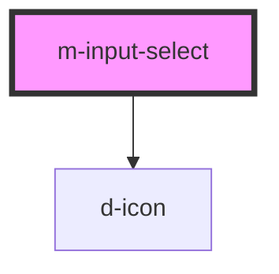

# m-input-select

<!-- Auto Generated Below -->

## Properties

| Property                | Attribute                  | Description                                   | Type                                     | Default                 |
| ----------------------- | -------------------------- | --------------------------------------------- | ---------------------------------------- | ----------------------- |
| `hint`                  | `hint`                     | Hint to display                               | `string \| undefined`                    | `undefined`             |
| `iconEnd`               | `icon-end`                 | The end icon for the select                   | `string \| undefined`                    | `undefined`             |
| `iconEndFamilyClass`    | `icon-end-family-class`    | Right icon family class                       | `string \| undefined`                    | `undefined`             |
| `iconEndFamilyPrefix`   | `icon-end-family-prefix`   | Right icon family class                       | `string \| undefined`                    | `undefined`             |
| `iconFamilyClass`       | `icon-family-class`        | Right icon family class                       | `string \| undefined`                    | `undefined`             |
| `iconFamilyPrefix`      | `icon-family-prefix`       | Right icon family class                       | `string \| undefined`                    | `undefined`             |
| `iconStart`             | `icon-start`               | The start icon for the select                 | `string \| undefined`                    | `undefined`             |
| `iconStartFamilyClass`  | `icon-start-family-class`  | Left icon family class                        | `string \| undefined`                    | `undefined`             |
| `iconStartFamilyPrefix` | `icon-start-family-prefix` | Left icon family class                        | `string \| undefined`                    | `undefined`             |
| `isDisabled`            | `is-disabled`              | Flag to disable the input                     | `boolean`                                | `false`                 |
| `isLoading`             | `is-loading`               | Flag for loading state.                       | `boolean`                                | `false`                 |
| `label`                 | `label`                    | The label text                                | `string`                                 | `''`                    |
| `labelExtractor`        | --                         | Callback to extract the label from the option | `(item: any) => string`                  | `(item) => item?.label` |
| `labelIcon`             | `label-icon`               | Icon for the label text                       | `string \| undefined`                    | `undefined`             |
| `labelIconFamilyClass`  | `label-icon-family-class`  | Icon label family class                       | `string \| undefined`                    | `undefined`             |
| `labelIconFamilyPrefix` | `label-icon-family-prefix` | Icon label family prefix                      | `string \| undefined`                    | `undefined`             |
| `mId` _(required)_      | `m-id`                     | The id of the input                           | `string`                                 | `undefined`             |
| `name`                  | `name`                     | The name of the input                         | `string \| undefined`                    | `undefined`             |
| `options`               | --                         | The select options                            | `Record<string, unknown>[]`              | `[]`                    |
| `selectedOption`        | --                         | The value selected of the component           | `undefined \| { [x: string]: unknown; }` | `undefined`             |
| `valueExtractor`        | --                         | Callback to extract the value from the option | `(item: any) => string \| number`        | `(item) => item?.value` |

## Events

| Event             | Description                               | Type                      |
| ----------------- | ----------------------------------------- | ------------------------- |
| `mBlur`           | Emitted when blur the input               | `CustomEvent<any>`        |
| `mChange`         | Emitted when the select value has changed | `CustomEvent<any>`        |
| `mIconEndClick`   | Emitted when click on the right icon      | `CustomEvent<MouseEvent>` |
| `mIconStartClick` | Emitted when click on the left icon       | `CustomEvent<MouseEvent>` |

## Dependencies

### Depends on

- [d-icon](../d-icon)

### Graph

----------------------------------------------

*Built with [StencilJS](https://stenciljs.com/)*
