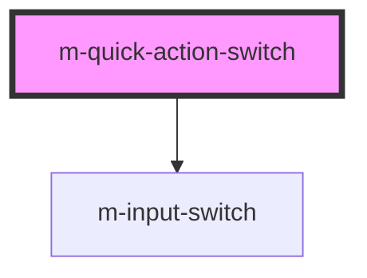

# m-quick-action-switch

<!-- Auto Generated Below -->

## Properties

| Property             | Attribute     | Description           | Type                   | Default     |
| -------------------- | ------------- | --------------------- | ---------------------- | ----------- |
| `hint` _(required)_  | `hint`        | Hint to display       | `string`               | `undefined` |
| `isChecked`          | `is-checked`  | Is checked            | `boolean \| undefined` | `undefined` |
| `isDisabled`         | `is-disabled` | Is disabled           | `boolean \| undefined` | `undefined` |
| `label` _(required)_ | `label`       | The label text        | `string`               | `undefined` |
| `mId` _(required)_   | `m-id`        | The id of the input   | `string`               | `undefined` |
| `name`               | `name`        | The name of the input | `string \| undefined`  | `undefined` |

## Events

| Event    | Description                               | Type                   |
| -------- | ----------------------------------------- | ---------------------- |
| `mClick` | Emitted when the select value has changed | `CustomEvent<boolean>` |

## Dependencies

### Depends on

- [m-input-switch](../m-input-switch)

### Graph

----------------------------------------------

*Built with [StencilJS](https://stenciljs.com/)*
