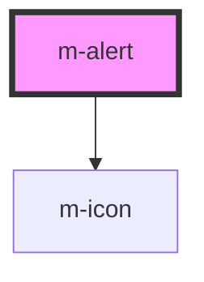

# m-alert

<!-- Auto Generated Below -->

## Properties

| Property   | Attribute   | Description                  | Type                   | Default     |
| ---------- | ----------- | ---------------------------- | ---------------------- | ----------- |
| `close`    | `close`     | Has close button             | `boolean \| undefined` | `undefined` |
| `icon`     | `icon`      | Show icon theme in the alert | `boolean`              | `false`     |
| `iconSize` | `icon-size` | Icon font-size class         | `string \| undefined`  | `'small'`   |
| `theme`    | `theme`     | Theme for the alert          | `string`               | `'warning'` |

## Events

| Event    | Description                               | Type               |
| -------- | ----------------------------------------- | ------------------ |
| `mClose` | Emitted when the button has been clicked. | `CustomEvent<any>` |

## Dependencies

### Depends on

- [m-icon](../m-icon)

### Graph

----------------------------------------------

*Built with [StencilJS](https://stenciljs.com/)*
