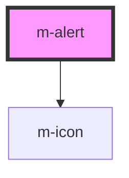

# m-alert

<!-- Auto Generated Below -->

## Properties

| Property    | Attribute    | Description                  | Type                                                                | Default     |
| ----------- | ------------ | ---------------------------- | ------------------------------------------------------------------- | ----------- |
| `showClose` | `show-close` | Show close button            | `boolean \| undefined`                                              | `undefined` |
| `showIcon`  | `show-icon`  | Show icon theme in the alert | `boolean`                                                           | `false`     |
| `type`      | `type`       | Theme for the alert          | `"danger" \| "dark" \| "info" \| "light" \| "success" \| "warning"` | `'light'`   |

## Events

| Event    | Description                               | Type               |
| -------- | ----------------------------------------- | ------------------ |
| `mClose` | Emitted when the button has been clicked. | `CustomEvent<any>` |

## Dependencies

### Depends on

- [m-icon](../m-icon)

### Graph

----------------------------------------------

*Built with [StencilJS](https://stenciljs.com/)*
