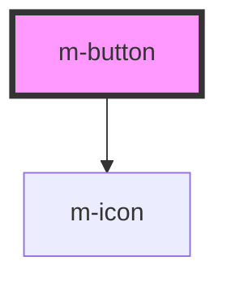

# m-button

<!-- Auto Generated Below -->

## Properties

| Property                | Attribute                  | Description                                  | Type                                                        | Default     |
| ----------------------- | -------------------------- | -------------------------------------------- | ----------------------------------------------------------- | ----------- |
| `iconEnd`               | `icon-end`                 | Icon right to display                        | `string \| undefined`                                       | `undefined` |
| `iconEndFamilyClass`    | `icon-end-family-class`    | Icon right family class                      | `string \| undefined`                                       | `undefined` |
| `iconEndFamilyPrefix`   | `icon-end-family-prefix`   | Icon right family prefix                     | `string \| undefined`                                       | `undefined` |
| `iconStart`             | `icon-start`               | Icon left to display                         | `string \| undefined`                                       | `undefined` |
| `iconStartFamilyClass`  | `icon-start-family-class`  | Icon left family class                       | `string \| undefined`                                       | `undefined` |
| `iconStartFamilyPrefix` | `icon-start-family-prefix` | Icon left family prefix                      | `string \| undefined`                                       | `undefined` |
| `isLoading`             | `is-loading`               | Flag for loading state and disable button.   | `boolean`                                                   | `false`     |
| `isPill`                | `is-pill`                  | Flag to switch to pill button border radius. | `boolean`                                                   | `false`     |
| `state`                 | `state`                    | Flag to set the button as active.            | `"active" \| "disabled" \| "focus" \| "hover" \| undefined` | `undefined` |
| `text`                  | `text`                     | The text to display.                         | `string`                                                    | `''`        |
| `theme`                 | `theme`                    | The theme to use.                            | `string`                                                    | `'primary'` |
| `type`                  | `type`                     | The type of the button.                      | `"button" \| "reset" \| "submit"`                           | `'button'`  |
| `value`                 | `value`                    | The value of the button.                     | `string`                                                    | `''`        |
| `variant`               | `variant`                  | The variant to use.                          | `"ghost" \| "outline" \| "text" \| undefined`               | `undefined` |

## Events

| Event    | Description                               | Type               |
| -------- | ----------------------------------------- | ------------------ |
| `mClick` | Emitted when the button has been clicked. | `CustomEvent<any>` |

## Dependencies

### Depends on

- [m-icon](../m-icon)

### Graph

----------------------------------------------

*Built with [StencilJS](https://stenciljs.com/)*
