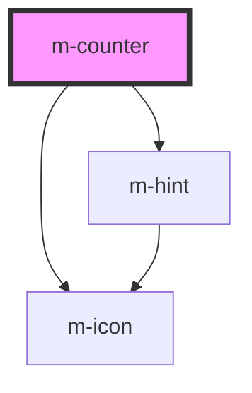

# m-counter

<!-- Auto Generated Below -->

## Properties

| Property                    | Attribute                       | Description                                                          | Type                         | Default         |
| --------------------------- | ------------------------------- | -------------------------------------------------------------------- | ---------------------------- | --------------- |
| `hint`                      | `hint`                          | Hint text                                                            | `string \| undefined`        | `undefined`     |
| `hintIconEnd`               | `hint-icon-end`                 | Right icon of the hint text                                          | `string \| undefined`        | `undefined`     |
| `hintIconEndFamilyClass`    | `hint-icon-end-family-class`    | Hint right icon family class                                         | `string \| undefined`        | `undefined`     |
| `hintIconEndFamilyPrefix`   | `hint-icon-end-family-prefix`   | Hint right icon family class                                         | `string \| undefined`        | `undefined`     |
| `hintIconStart`             | `hint-icon-start`               | Left icon of the hint text                                           | `string \| undefined`        | `undefined`     |
| `hintIconStartFamilyClass`  | `hint-icon-start-family-class`  | Hint left icon family class                                          | `string \| undefined`        | `undefined`     |
| `hintIconStartFamilyPrefix` | `hint-icon-start-family-prefix` | Hint left icon family class                                          | `string \| undefined`        | `undefined`     |
| `isDisabled`                | `is-disabled`                   | Is disabled counter                                                  | `boolean`                    | `false`         |
| `label`                     | `label`                         | Label of the input                                                   | `string \| undefined`        | `undefined`     |
| `labelIcon`                 | `label-icon`                    | Icon for the label text                                              | `string`                     | `'info-circle'` |
| `labelIconFamilyClass`      | `label-icon-family-class`       | Icon label family class                                              | `string \| undefined`        | `undefined`     |
| `labelIconFamilyPrefix`     | `label-icon-family-prefix`      | Icon label family class                                              | `string \| undefined`        | `undefined`     |
| `layoutDirection`           | `layout-direction`              | Change the layout direction to put the label on top or left of input | `"horizontal" \| "vertical"` | `'vertical'`    |
| `mId` _(required)_          | `m-id`                          | Id of the input                                                      | `string`                     | `undefined`     |
| `maxValue` _(required)_     | `max-value`                     | Maximum value for the input                                          | `number`                     | `undefined`     |
| `minValue` _(required)_     | `min-value`                     | Minimum value for the input                                          | `number`                     | `undefined`     |
| `theme`                     | `theme`                         | Theme of the counter                                                 | `string \| undefined`        | `undefined`     |
| `value` _(required)_        | `value`                         | Value of the input                                                   | `number`                     | `undefined`     |
| `variant`                   | `variant`                       | Variant of the counter                                               | `"default" \| "prime"`       | `'default'`     |

## Events

| Event    | Description              | Type               |
| -------- | ------------------------ | ------------------ |
| `mClick` | Event for button pressed | `CustomEvent<any>` |
| `mInput` | Event for input change   | `CustomEvent<any>` |

## Dependencies

### Depends on

- [m-icon](../m-icon)
- [m-hint](../m-hint)

### Graph

----------------------------------------------

*Built with [StencilJS](https://stenciljs.com/)*
