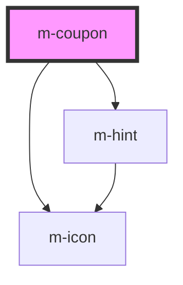

# m-coupon

<!-- Auto Generated Below -->

## Properties

| Property                    | Attribute                       | Description                                                          | Type                         | Default         |
| --------------------------- | ------------------------------- | -------------------------------------------------------------------- | ---------------------------- | --------------- |
| `buttonText`                | `button-text`                   | Text for the coupon button                                           | `string`                     | `'Apply'`       |
| `hasSelect`                 | `has-select`                    | Has a select input                                                   | `boolean`                    | `false`         |
| `hint`                      | `hint`                          | Hint for the m-coupon                                                | `string \| undefined`        | `undefined`     |
| `hintIconEnd`               | `hint-icon-end`                 | Icon end for the hint text                                           | `string \| undefined`        | `undefined`     |
| `hintIconEndFamilyClass`    | `hint-icon-end-family-class`    | Hint right icon family class                                         | `string \| undefined`        | `undefined`     |
| `hintIconEndFamilyPrefix`   | `hint-icon-end-family-prefix`   | Hint right icon family class                                         | `string \| undefined`        | `undefined`     |
| `hintIconStart`             | `hint-icon-start`               | Icon start for the hint text                                         | `string \| undefined`        | `undefined`     |
| `hintIconStartFamilyClass`  | `hint-icon-start-family-class`  | Hint left icon family class                                          | `string \| undefined`        | `undefined`     |
| `hintIconStartFamilyPrefix` | `hint-icon-start-family-prefix` | Hint left icon family class                                          | `string \| undefined`        | `undefined`     |
| `iconEnd`                   | `icon-end`                      | Icon of the end                                                      | `string \| undefined`        | `undefined`     |
| `iconEndFamilyClass`        | `icon-end-family-class`         | Right icon family class                                              | `string \| undefined`        | `undefined`     |
| `iconEndFamilyPrefix`       | `icon-end-family-prefix`        | Right icon family class                                              | `string \| undefined`        | `undefined`     |
| `iconMiddle`                | `icon-middle`                   | Icon of the middle                                                   | `string \| undefined`        | `undefined`     |
| `iconMiddleFamilyClass`     | `icon-middle-family-class`      | Middle icon family class                                             | `string \| undefined`        | `undefined`     |
| `iconMiddleFamilyPrefix`    | `icon-middle-family-prefix`     | Middle icon family class                                             | `string \| undefined`        | `undefined`     |
| `iconStart`                 | `icon-start`                    | Icon of the left                                                     | `string \| undefined`        | `undefined`     |
| `iconStartFamilyClass`      | `icon-start-family-class`       | Left icon family class                                               | `string \| undefined`        | `undefined`     |
| `iconStartFamilyPrefix`     | `icon-start-family-prefix`      | Left icon family class                                               | `string \| undefined`        | `undefined`     |
| `isLoading`                 | `is-loading`                    | Flag for loading state.                                              | `boolean`                    | `false`         |
| `label`                     | `label`                         | Label for the input                                                  | `string`                     | `''`            |
| `labelIcon`                 | `label-icon`                    | Icon for the label text                                              | `string`                     | `'info-circle'` |
| `labelIconFamilyClass`      | `label-icon-family-class`       | Icon label family class                                              | `string \| undefined`        | `undefined`     |
| `labelIconFamilyPrefix`     | `label-icon-family-prefix`      | Icon label family class                                              | `string \| undefined`        | `undefined`     |
| `layoutDirection`           | `layout-direction`              | Change the layout direction to put the label on top or left of input | `"horizontal" \| "vertical"` | `'vertical'`    |
| `mId` _(required)_          | `m-id`                          | Id for the input                                                     | `string`                     | `undefined`     |
| `placeholder`               | `placeholder`                   | Placeholder for the input                                            | `string \| undefined`        | `''`            |
| `theme`                     | `theme`                         | Theme for the m-cupon                                                | `string \| undefined`        | `undefined`     |
| `type`                      | `type`                          | * The type of the input                                              | `"number" \| "text"`         | `'text'`        |

## Events

| Event    | Description                        | Type                                                                                  |
| -------- | ---------------------------------- | ------------------------------------------------------------------------------------- |
| `mClick` | Emitted when the button is clicked | `CustomEvent<{ inputValue: string \| undefined; selectValue: string \| undefined; }>` |

## Dependencies

### Depends on

- [m-icon](../m-icon)
- [m-hint](../m-hint)

### Graph

----------------------------------------------

*Built with [StencilJS](https://stenciljs.com/)*
