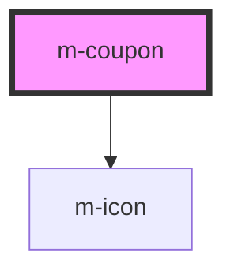

# m-coupon

<!-- Auto Generated Below -->

## Properties

| Property           | Attribute          | Description                                                          | Type                         | Default         |
| ------------------ | ------------------ | -------------------------------------------------------------------- | ---------------------------- | --------------- |
| `hasSelect`        | `has-select`       | Has a select input                                                   | `boolean`                    | `false`         |
| `hint`             | `hint`             | Hint for the m-cupon                                                 | `string \| undefined`        | `undefined`     |
| `hintIconEnd`      | `hint-icon-end`    | Icon end for the hint text                                           | `string \| undefined`        | `undefined`     |
| `hintIconStart`    | `hint-icon-start`  | Icon start for the hint text                                         | `string \| undefined`        | `undefined`     |
| `iconEnd`          | `icon-end`         | Icon of the end                                                      | `string \| undefined`        | `undefined`     |
| `iconLabel`        | `icon-label`       | Icon for the label text                                              | `string \| undefined`        | `'info-circle'` |
| `iconMiddle`       | `icon-middle`      | Icon of the middle                                                   | `string \| undefined`        | `undefined`     |
| `iconStart`        | `icon-start`       | Icon of the left                                                     | `string \| undefined`        | `undefined`     |
| `label`            | `label`            | Label for the input                                                  | `string`                     | `''`            |
| `layoutDirection`  | `layout-direction` | Change the layout direction to put the label on top or left of input | `"horizontal" \| "vertical"` | `'vertical'`    |
| `mId` _(required)_ | `m-id`             | Id for the input                                                     | `string`                     | `undefined`     |
| `placeholder`      | `placeholder`      | Placeholder for the input                                            | `string \| undefined`        | `''`            |
| `textButton`       | `text-button`      | Text for the button                                                  | `string \| undefined`        | `'Apply'`       |
| `theme`            | `theme`            | Theme for the m-cupon                                                | `string \| undefined`        | `'primary'`     |
| `type`             | `type`             | * The type of the input                                              | `"number" \| "text"`         | `'text'`        |

## Events

| Event    | Description                        | Type                                                                                  |
| -------- | ---------------------------------- | ------------------------------------------------------------------------------------- |
| `mClick` | Emitted when the button is clicked | `CustomEvent<{ inputValue: string \| undefined; selectValue: string \| undefined; }>` |

## Dependencies

### Depends on

- [m-icon](../m-icon)

### Graph

----------------------------------------------

*Built with [StencilJS](https://stenciljs.com/)*
