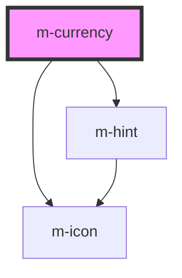

# m-currency

<!-- Auto Generated Below -->

## Properties

| Property                       | Attribute                       | Description                                                          | Type                              | Default                 |
| ------------------------------ | ------------------------------- | -------------------------------------------------------------------- | --------------------------------- | ----------------------- |
| `currencyOptions` _(required)_ | --                              | Options for the m-currency                                           | `Options`                         | `undefined`             |
| `hint`                         | `hint`                          | Hint text for the m-currency                                         | `string \| undefined`             | `undefined`             |
| `hintIconEnd`                  | `hint-icon-end`                 | Icon end for the hint text                                           | `string \| undefined`             | `undefined`             |
| `hintIconEndFamilyClass`       | `hint-icon-end-family-class`    | Hint right icon family class                                         | `string \| undefined`             | `undefined`             |
| `hintIconEndFamilyPrefix`      | `hint-icon-end-family-prefix`   | Hint right icon family class                                         | `string \| undefined`             | `undefined`             |
| `hintIconStart`                | `hint-icon-start`               | Icon start for the hint text                                         | `string \| undefined`             | `undefined`             |
| `hintIconStartFamilyClass`     | `hint-icon-start-family-class`  | Hint left icon family class                                          | `string \| undefined`             | `undefined`             |
| `hintIconStartFamilyPrefix`    | `hint-icon-start-family-prefix` | Hint left icon family class                                          | `string \| undefined`             | `undefined`             |
| `iconEnd`                      | `icon-end`                      | Icon for the end                                                     | `string \| undefined`             | `undefined`             |
| `iconEndFamilyClass`           | `icon-end-family-class`         | Right icon family class                                              | `string \| undefined`             | `undefined`             |
| `iconEndFamilyPrefix`          | `icon-end-family-prefix`        | Right icon family class                                              | `string \| undefined`             | `undefined`             |
| `iconLabel`                    | `icon-label`                    | Icon for the label text                                              | `string`                          | `'info-circle'`         |
| `iconLabelFamilyClass`         | `icon-label-family-class`       | Icon label family class                                              | `string \| undefined`             | `undefined`             |
| `iconLabelFamilyPrefix`        | `icon-label-family-prefix`      | Icon label family class                                              | `string \| undefined`             | `undefined`             |
| `iconMiddle`                   | `icon-middle`                   | Icon for the middle                                                  | `string \| undefined`             | `undefined`             |
| `iconMiddleFamilyClass`        | `icon-middle-family-class`      | Middle icon family class                                             | `string \| undefined`             | `undefined`             |
| `iconMiddleFamilyPrefix`       | `icon-middle-family-prefix`     | Middle icon family class                                             | `string \| undefined`             | `undefined`             |
| `iconStart`                    | `icon-start`                    | Icon for the left                                                    | `string \| undefined`             | `undefined`             |
| `iconStartFamilyClass`         | `icon-start-family-class`       | Left icon family class                                               | `string \| undefined`             | `undefined`             |
| `iconStartFamilyPrefix`        | `icon-start-family-prefix`      | Left icon family class                                               | `string \| undefined`             | `undefined`             |
| `label`                        | `label`                         | Label for the input                                                  | `string`                          | `''`                    |
| `labelExtractor`               | --                              | Callback to extract the label from the option                        | `(item: any) => string`           | `(item) => item?.label` |
| `layoutDirection`              | `layout-direction`              | Change the layout direction to put the label on top or left of input | `"horizontal" \| "vertical"`      | `'vertical'`            |
| `mId` _(required)_             | `m-id`                          | Id for the input                                                     | `string`                          | `undefined`             |
| `maxValue`                     | `max-value`                     | * The max value of the input                                         | `number \| undefined`             | `undefined`             |
| `minValue`                     | `min-value`                     | * The min value of the input                                         | `number \| undefined`             | `undefined`             |
| `placeholder`                  | `placeholder`                   | Placeholder for the input                                            | `string \| undefined`             | `''`                    |
| `selectOptions`                | --                              | Select options                                                       | `any[]`                           | `[]`                    |
| `theme`                        | `theme`                         | Theme for the m-currency                                             | `string`                          | `'primary'`             |
| `value`                        | `value`                         | * The value of the input                                             | `number \| undefined`             | `undefined`             |
| `valueExtractor`               | --                              | Callback to extract the value from the option                        | `(item: any) => string \| number` | `(item) => item?.value` |
| `variant`                      | `variant`                       | Variant for the m-currency                                           | `"prime" \| undefined`            | `undefined`             |

## Events

| Event     | Description                    | Type                                                                           |
| --------- | ------------------------------ | ------------------------------------------------------------------------------ |
| `mChange` | Emitted when the inputs change | `CustomEvent<{ amount: number \| undefined; currency: string \| undefined; }>` |

## Dependencies

### Depends on

- [m-icon](../m-icon)
- [m-hint](../m-hint)

### Graph

----------------------------------------------

*Built with [StencilJS](https://stenciljs.com/)*
