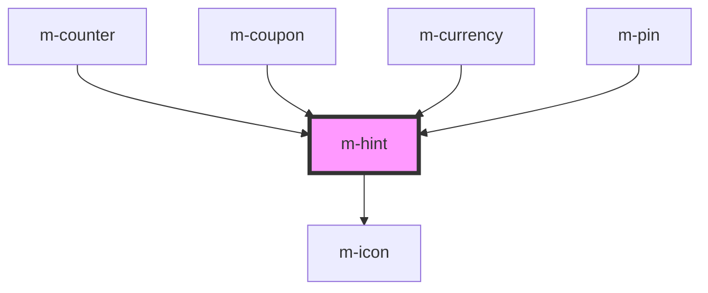

# m-hint

<!-- Auto Generated Below -->

## Properties

| Property                | Attribute                  | Description             | Type                  | Default     |
| ----------------------- | -------------------------- | ----------------------- | --------------------- | ----------- |
| `iconEnd`               | `icon-end`                 | Right icon for the hint | `string \| undefined` | `undefined` |
| `iconEndFamilyClass`    | `icon-end-family-class`    | Right icon family class | `string \| undefined` | `undefined` |
| `iconEndFamilyPrefix`   | `icon-end-family-prefix`   | Right icon family class | `string \| undefined` | `undefined` |
| `iconSize`              | `icon-size`                | Size for the icons      | `string`              | `'inherit'` |
| `iconStart`             | `icon-start`               | Left icon for the hint  | `string \| undefined` | `undefined` |
| `iconStartFamilyClass`  | `icon-start-family-class`  | Left icon family class  | `string \| undefined` | `undefined` |
| `iconStartFamilyPrefix` | `icon-start-family-prefix` | Left icon family class  | `string \| undefined` | `undefined` |
| `text` _(required)_     | `text`                     | Hint text               | `string`              | `undefined` |
| `theme`                 | `theme`                    | Theme for the hint      | `string \| undefined` | `undefined` |

## Dependencies

### Used by

 - [m-counter](../m-counter)
 - [m-coupon](../m-coupon)
 - [m-currency](../m-currency)
 - [m-pin](../m-pin)

### Depends on

- [m-icon](../m-icon)

### Graph

----------------------------------------------

*Built with [StencilJS](https://stenciljs.com/)*
