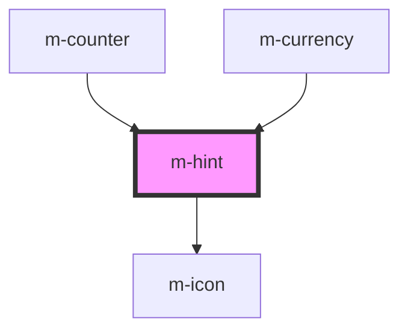

# m-hint

<!-- Auto Generated Below -->

## Properties

| Property            | Attribute    | Description             | Type                  | Default     |
| ------------------- | ------------ | ----------------------- | --------------------- | ----------- |
| `iconEnd`           | `icon-end`   | Right icon for the hint | `string \| undefined` | `undefined` |
| `iconSize`          | `icon-size`  | Size for the icons      | `string`              | `'inherit'` |
| `iconStart`         | `icon-start` | Left icon for the hint  | `string \| undefined` | `undefined` |
| `text` _(required)_ | `text`       | Hint text               | `string`              | `undefined` |
| `theme`             | `theme`      | Theme for the hint      | `string`              | `'info'`    |

## Dependencies

### Used by

 - [m-counter](../m-counter)
 - [m-currency](../m-currency)

### Depends on

- [m-icon](../m-icon)

### Graph

----------------------------------------------

*Built with [StencilJS](https://stenciljs.com/)*
