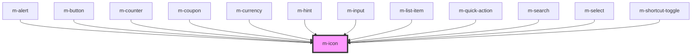

# m-icon

<!-- Auto Generated Below -->

## Properties

| Property            | Attribute          | Description                         | Type                  | Default     |
| ------------------- | ------------------ | ----------------------------------- | --------------------- | ----------- |
| `backgroundColor`   | `background-color` | To set background color             | `string \| undefined` | `undefined` |
| `color`             | `color`            | To set css color                    | `string \| undefined` | `undefined` |
| `duration`          | `duration`         | Loading animation duration          | `number`              | `1.8`       |
| `icon` _(required)_ | `icon`             | Name of icon to use (in kebab-case) | `string`              | `undefined` |
| `isLoading`         | `is-loading`       | Is loading                          | `boolean`             | `false`     |
| `size`              | `size`             | Font size of the icon               | `string \| undefined` | `'inherit'` |
| `theme`             | `theme`            | Theme of the icon                   | `string \| undefined` | `undefined` |

## Dependencies

### Used by

 - [m-alert](../m-alert)
 - [m-button](../m-button)
 - [m-counter](../m-counter)
 - [m-coupon](../m-coupon)
 - [m-currency](../m-currency)
 - [m-hint](../m-hint)
 - [m-input](../m-input)
 - [m-list-item](../m-list-item)
 - [m-quick-action](../m-quick-action)
 - [m-search](../m-search)
 - [m-select](../m-select)
 - [m-shortcut-toggle](../m-shortcut-toggle)

### Graph

----------------------------------------------

*Built with [StencilJS](https://stenciljs.com/)*
