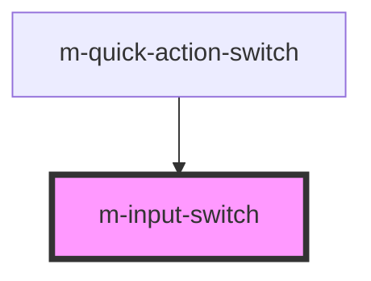

# m-input-switch

<!-- Auto Generated Below -->

## Properties

| Property           | Attribute     | Description                        | Type                   | Default     |
| ------------------ | ------------- | ---------------------------------- | ---------------------- | ----------- |
| `isChecked`        | `is-checked`  | Flag to change the check state     | `boolean \| undefined` | `undefined` |
| `isDisabled`       | `is-disabled` | Flag to disable the input          | `boolean`              | `false`     |
| `label`            | `label`       | The text to display in the switch. | `string \| undefined`  | `undefined` |
| `mId` _(required)_ | `m-id`        | Id                                 | `string`               | `undefined` |
| `name`             | `name`        | Id                                 | `string \| undefined`  | `undefined` |

## Events

| Event     | Description                         | Type                   |
| --------- | ----------------------------------- | ---------------------- |
| `mChange` | Emitted when the switch has changed | `CustomEvent<boolean>` |

## Dependencies

### Used by

 - [m-quick-action-switch](../m-quick-action-switch)

### Graph

----------------------------------------------

*Built with [StencilJS](https://stenciljs.com/)*
