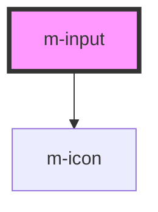

# m-input

<!-- Auto Generated Below -->

## Properties

| Property           | Attribute          | Description                                                          | Type                         | Default      |
| ------------------ | ------------------ | -------------------------------------------------------------------- | ---------------------------- | ------------ |
| `hint`             | `hint`             | Hint to display, also used to display validity feedback              | `string \| undefined`        | `undefined`  |
| `hintIconEnd`      | `hint-icon-end`    | Icon to display on hint right                                        | `string \| undefined`        | `undefined`  |
| `hintIconStart`    | `hint-icon-start`  | Icon to display on hint left                                         | `string \| undefined`        | `undefined`  |
| `iconEnd`          | `icon-end`         | Icon to display on input right                                       | `string \| undefined`        | `undefined`  |
| `iconStart`        | `icon-start`       | Icon to display on input left                                        | `string \| undefined`        | `undefined`  |
| `isDisabled`       | `is-disabled`      | Flag to disable the input                                            | `boolean`                    | `false`      |
| `label`            | `label`            | The label text                                                       | `string`                     | `''`         |
| `labelIcon`        | `label-icon`       | Icon to display on label right                                       | `string \| undefined`        | `undefined`  |
| `layoutDirection`  | `layout-direction` | Change the layout direction to put the label on top or left of input | `"horizontal" \| "vertical"` | `'vertical'` |
| `mId` _(required)_ | `m-id`             | The id of the input                                                  | `string`                     | `undefined`  |
| `placeholder`      | `placeholder`      | The placeholder text                                                 | `string`                     | `''`         |
| `type`             | `type`             | The type of the input                                                | `string`                     | `'text'`     |
| `value`            | `value`            | The value of the input                                               | `string`                     | `''`         |

## Events

| Event     | Description                              | Type                  |
| --------- | ---------------------------------------- | --------------------- |
| `mChange` | Emitted when the input value has changed | `CustomEvent<string>` |

## Dependencies

### Depends on

- [m-icon](../m-icon)

### Graph

----------------------------------------------

*Built with [StencilJS](https://stenciljs.com/)*
