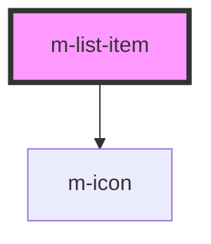

# m-list-item

<!-- Auto Generated Below -->

## Properties

| Property           | Attribute            | Description                                      | Type                                                                                                                | Default     |
| ------------------ | -------------------- | ------------------------------------------------ | ------------------------------------------------------------------------------------------------------------------- | ----------- |
| `alternativeValue` | `alternative-value`  | Alternative value                                | `number \| string \| undefined`                                                                                     | `undefined` |
| `icon`             | `icon`               | The icon to display                              | `string \| undefined`                                                                                               | `undefined` |
| `iconFamilyClass`  | `icon-family-class`  | Icon family class                                | `string \| undefined`                                                                                               | `undefined` |
| `iconFamilyPrefix` | `icon-family-prefix` | Icon family class                                | `string \| undefined`                                                                                               | `undefined` |
| `image`            | `image`              | Url to replace the default icon image            | `null \| string`                                                                                                    | `null`      |
| `isPill`           | `is-pill`            | Has borders rounded                              | `boolean`                                                                                                           | `false`     |
| `navegableProps`   | --                   | Props for the list item navegable variant        | `undefined \| { href: string; target?: string \| undefined; 'aria-current'?: string \| undefined; }`                | `undefined` |
| `selectableProps`  | --                   | Props for the list item selectable variant       | `undefined \| { id: string; name: string; value?: string \| number \| undefined; checked?: boolean \| undefined; }` | `undefined` |
| `subtext`          | `subtext`            | Subtext of the list.                             | `string`                                                                                                            | `''`        |
| `text`             | `text`               | Main text of the list.                           | `string`                                                                                                            | `''`        |
| `theme`            | `theme`              | The theme to use.                                | `string \| undefined`                                                                                               | `undefined` |
| `themeValue`       | `theme-value`        | Theme to apply in the list value                 | `string \| undefined`                                                                                               | `'gray'`    |
| `value`            | `value`              | Value of the list                                | `number \| string \| undefined`                                                                                     | `undefined` |
| `variant`          | `variant`            | Variant for text item list or complete item list | `"default" \| "navegable" \| "selectable" \| undefined`                                                             | `undefined` |

## Dependencies

### Depends on

- [m-icon](../m-icon)

### Graph

----------------------------------------------

*Built with [StencilJS](https://stenciljs.com/)*
