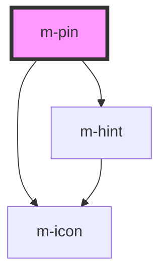

# m-pin

<!-- Auto Generated Below -->

## Properties

| Property                    | Attribute                       | Description                     | Type                           | Default         |
| --------------------------- | ------------------------------- | ------------------------------- | ------------------------------ | --------------- |
| `characters`                | `characters`                    | Number of characters of the pin | `number`                       | `4`             |
| `hint`                      | `hint`                          | Hint for the m-coupon           | `string \| undefined`          | `undefined`     |
| `hintIconEnd`               | `hint-icon-end`                 | Icon end for the hint text      | `string \| undefined`          | `undefined`     |
| `hintIconEndFamilyClass`    | `hint-icon-end-family-class`    | Hint right icon family class    | `string \| undefined`          | `undefined`     |
| `hintIconEndFamilyPrefix`   | `hint-icon-end-family-prefix`   | Hint right icon family class    | `string \| undefined`          | `undefined`     |
| `hintIconStart`             | `hint-icon-start`               | Icon start for the hint text    | `string \| undefined`          | `undefined`     |
| `hintIconStartFamilyClass`  | `hint-icon-start-family-class`  | Hint left icon family class     | `string \| undefined`          | `undefined`     |
| `hintIconStartFamilyPrefix` | `hint-icon-start-family-prefix` | Hint left icon family class     | `string \| undefined`          | `undefined`     |
| `iconEnd`                   | `icon-end`                      | Icon of the end                 | `string \| undefined`          | `undefined`     |
| `iconEndFamilyClass`        | `icon-end-family-class`         | Right icon family class         | `string \| undefined`          | `undefined`     |
| `iconEndFamilyPrefix`       | `icon-end-family-prefix`        | Right icon family class         | `string \| undefined`          | `undefined`     |
| `iconStart`                 | `icon-start`                    | Icon of the left                | `string \| undefined`          | `undefined`     |
| `iconStartFamilyClass`      | `icon-start-family-class`       | Left icon family class          | `string \| undefined`          | `undefined`     |
| `iconStartFamilyPrefix`     | `icon-start-family-prefix`      | Left icon family class          | `string \| undefined`          | `undefined`     |
| `isDisabled`                | `is-disabled`                   | Disable the inputs              | `boolean`                      | `false`         |
| `isLoading`                 | `is-loading`                    | Flag for loading state.         | `boolean`                      | `false`         |
| `isSecret`                  | `is-secret`                     | Hide the characters             | `boolean`                      | `false`         |
| `label`                     | `label`                         | Label for the input             | `string`                       | `''`            |
| `labelIcon`                 | `label-icon`                    | Icon for the label text         | `string \| undefined`          | `'info-circle'` |
| `labelIconFamilyClass`      | `label-icon-family-class`       | Icon label family class         | `string \| undefined`          | `undefined`     |
| `labelIconFamilyPrefix`     | `label-icon-family-prefix`      | Icon label family class         | `string \| undefined`          | `undefined`     |
| `mId` _(required)_          | `m-id`                          | Id for the input                | `string`                       | `undefined`     |
| `mInputMode`                | `m-input-mode`                  | Keyboard style                  | `"numeric" \| "tel" \| "text"` | `'text'`        |
| `mType`                     | `m-type`                        | Type of the inputs              | `"number" \| "tel" \| "text"`  | `'text'`        |
| `placeholder`               | `placeholder`                   | Placeholder of the inputs       | `string \| undefined`          | `'•'`           |
| `theme`                     | `theme`                         | Theme for inputs                | `string \| undefined`          | `undefined`     |

## Events

| Event     | Description                         | Type                  |
| --------- | ----------------------------------- | --------------------- |
| `mChange` | Emitted when the inputs had changed | `CustomEvent<string>` |

## Dependencies

### Depends on

- [m-icon](../m-icon)
- [m-hint](../m-hint)

### Graph

----------------------------------------------

*Built with [StencilJS](https://stenciljs.com/)*
