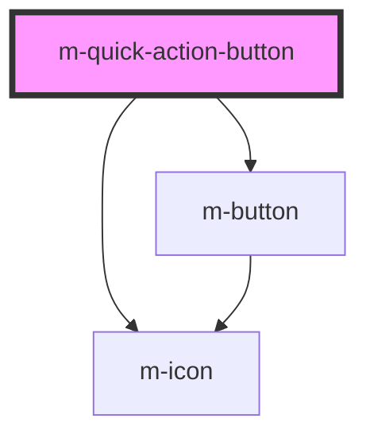

# m-quick-action

<!-- Auto Generated Below -->

## Properties

| Property                         | Attribute                           | Description                                                            | Type                   | Default           |
| -------------------------------- | ----------------------------------- | ---------------------------------------------------------------------- | ---------------------- | ----------------- |
| `actionIcon`                     | `action-icon`                       | The icon to indicate the action                                        | `string`               | `'chevron-right'` |
| `actionIconFamilyClass`          | `action-icon-family-class`          | Icon family class                                                      | `string \| undefined`  | `undefined`       |
| `actionIconFamilyPrefix`         | `action-icon-family-prefix`         | Icon family class                                                      | `string \| undefined`  | `undefined`       |
| `actionLinkText`                 | `action-link-text`                  | Action link text, displayed when the icon is not set                   | `string \| undefined`  | `undefined`       |
| `actionLinkTheme`                | `action-link-theme`                 | Action link theme                                                      | `string`               | `'secondary'`     |
| `line1` _(required)_             | `line-1`                            | The title                                                              | `string`               | `undefined`       |
| `line2` _(required)_             | `line-2`                            | The subtitle                                                           | `string`               | `undefined`       |
| `representativeIcon`             | `representative-icon`               | Representative icon, displayed when the representativeImage is not set | `string \| undefined`  | `undefined`       |
| `representativeIconFamilyClass`  | `representative-icon-family-class`  | Icon family class                                                      | `string \| undefined`  | `undefined`       |
| `representativeIconFamilyPrefix` | `representative-icon-family-prefix` | Icon family class                                                      | `string \| undefined`  | `undefined`       |
| `representativeIconHasCircle`    | `representative-icon-has-circle`    | Representative icon circle                                             | `boolean \| undefined` | `false`           |
| `representativeIconTheme`        | `representative-icon-theme`         | Representative icon theme                                              | `string`               | `'secondary'`     |
| `representativeImage`            | `representative-image`              | Representative image                                                   | `string \| undefined`  | `undefined`       |

## Events

| Event    | Description                              | Type               |
| -------- | ---------------------------------------- | ------------------ |
| `mClick` | Emitted when the input value has changed | `CustomEvent<any>` |

## Dependencies

### Depends on

- [m-icon](../m-icon)
- [m-button](../m-button)

### Graph

----------------------------------------------

*Built with [StencilJS](https://stenciljs.com/)*
