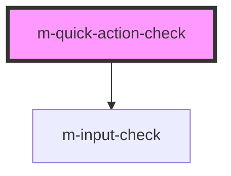

# m-quick-action-select

<!-- Auto Generated Below -->

## Properties

| Property             | Attribute    | Description         | Type                   | Default     |
| -------------------- | ------------ | ------------------- | ---------------------- | ----------- |
| `isChecked`          | `is-checked` | Is selected         | `boolean \| undefined` | `undefined` |
| `line1` _(required)_ | `line-1`     | Line 1 text         | `string`               | `undefined` |
| `line2` _(required)_ | `line-2`     | Line 2 text         | `string`               | `undefined` |
| `line3` _(required)_ | `line-3`     | Line 3 text         | `string`               | `undefined` |
| `mId` _(required)_   | `m-id`       | The id of the input | `string`               | `undefined` |
| `name` _(required)_  | `name`       | Name of the input   | `string`               | `undefined` |
| `value` _(required)_ | `value`      | Input value         | `string`               | `undefined` |

## Events

| Event     | Description                               | Type                  |
| --------- | ----------------------------------------- | --------------------- |
| `mChange` | Emitted when the select value has changed | `CustomEvent<string>` |

## Dependencies

### Depends on

- [m-input-check](../m-input-check)

### Graph

----------------------------------------------

*Built with [StencilJS](https://stenciljs.com/)*
