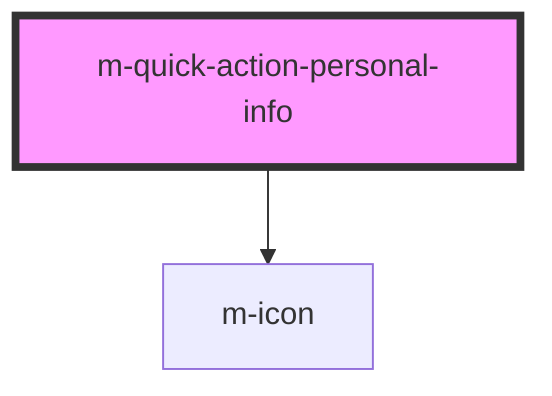

# m-quick-action

<!-- Auto Generated Below -->

## Properties

| Property               | Attribute            | Description                     | Type                  | Default           |
| ---------------------- | -------------------- | ------------------------------- | --------------------- | ----------------- |
| `account` _(required)_ | `account`            | The person account number       | `string`              | `undefined`       |
| `bank` _(required)_    | `bank`               | The person bank name            | `string`              | `undefined`       |
| `icon`                 | `icon`               | The icon to indicate the action | `string`              | `'chevron-right'` |
| `iconFamilyClass`      | `icon-family-class`  | Icon family class               | `string \| undefined` | `undefined`       |
| `iconFamilyPrefix`     | `icon-family-prefix` | Icon family class               | `string \| undefined` | `undefined`       |
| `image` _(required)_   | `image`              | The person profile image        | `string`              | `undefined`       |
| `name` _(required)_    | `name`               | The person name                 | `string`              | `undefined`       |

## Events

| Event    | Description                              | Type               |
| -------- | ---------------------------------------- | ------------------ |
| `mClick` | Emitted when the input value has changed | `CustomEvent<any>` |

## Dependencies

### Depends on

- [m-icon](../m-icon)

### Graph

----------------------------------------------

*Built with [StencilJS](https://stenciljs.com/)*
