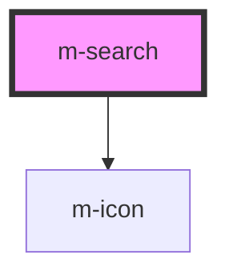

# m-search

<!-- Auto Generated Below -->

## Properties

| Property                    | Attribute                       | Description                                                          | Type                         | Default      |
| --------------------------- | ------------------------------- | -------------------------------------------------------------------- | ---------------------------- | ------------ |
| `hint`                      | `hint`                          | Hint to display, also used to display validity feedback              | `string \| undefined`        | `undefined`  |
| `hintIconEnd`               | `hint-icon-end`                 | Icon to display on hint right                                        | `string \| undefined`        | `undefined`  |
| `hintIconEndFamilyClass`    | `hint-icon-end-family-class`    | Hint right icon family class                                         | `string \| undefined`        | `undefined`  |
| `hintIconEndFamilyPrefix`   | `hint-icon-end-family-prefix`   | Hint right icon family class                                         | `string \| undefined`        | `undefined`  |
| `hintIconStart`             | `hint-icon-start`               | Icon to display on hint left                                         | `string \| undefined`        | `undefined`  |
| `hintIconStartFamilyClass`  | `hint-icon-start-family-class`  | Hint left icon family class                                          | `string \| undefined`        | `undefined`  |
| `hintIconStartFamilyPrefix` | `hint-icon-start-family-prefix` | Hint left icon family class                                          | `string \| undefined`        | `undefined`  |
| `iconEnd`                   | `icon-end`                      | Icon to display on input right                                       | `string \| undefined`        | `undefined`  |
| `iconEndFamilyClass`        | `icon-end-family-class`         | Right icon family class                                              | `string \| undefined`        | `undefined`  |
| `iconEndFamilyPrefix`       | `icon-end-family-prefix`        | Right icon family class                                              | `string \| undefined`        | `undefined`  |
| `isDisabled`                | `is-disabled`                   | Flag to disable the input                                            | `boolean`                    | `false`      |
| `isReadOnly`                | `is-read-only`                  | Flag to read only the input                                          | `boolean`                    | `false`      |
| `label`                     | `label`                         | The label text                                                       | `string`                     | `''`         |
| `labelIcon`                 | `label-icon`                    | Icon to display on label right                                       | `string \| undefined`        | `undefined`  |
| `labelIconFamilyClass`      | `label-icon-family-class`       | Icon label family class                                              | `string \| undefined`        | `undefined`  |
| `labelIconFamilyPrefix`     | `label-icon-family-prefix`      | Icon label family class                                              | `string \| undefined`        | `undefined`  |
| `layoutDirection`           | `layout-direction`              | Change the layout direction to put the label on top or left of input | `"horizontal" \| "vertical"` | `'vertical'` |
| `mId` _(required)_          | `m-id`                          | The id of the input                                                  | `string`                     | `undefined`  |
| `placeholder`               | `placeholder`                   | The placeholder text                                                 | `string`                     | `''`         |
| `theme`                     | `theme`                         | Theme to use for the search                                          | `string \| undefined`        | `undefined`  |
| `type`                      | `type`                          | The type of the input                                                | `string`                     | `'text'`     |
| `value`                     | `value`                         | The value of the input                                               | `string`                     | `''`         |
| `variant`                   | `variant`                       | Variant to use for the search                                        | `string \| undefined`        | `undefined`  |

## Events

| Event     | Description                              | Type                  |
| --------- | ---------------------------------------- | --------------------- |
| `mChange` | Emitted when the input value has changed | `CustomEvent<string>` |
| `mClick`  | Emitted when the button is clicked       | `CustomEvent<string>` |

## Dependencies

### Depends on

- [m-icon](../m-icon)

### Graph

----------------------------------------------

*Built with [StencilJS](https://stenciljs.com/)*
