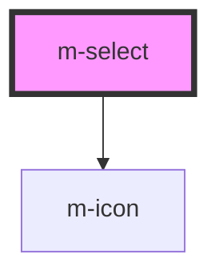

# m-select

<!-- Auto Generated Below -->

## Properties

| Property           | Attribute          | Description                                                           | Type                                              | Default                 |
| ------------------ | ------------------ | --------------------------------------------------------------------- | ------------------------------------------------- | ----------------------- |
| `hint`             | `hint`             | The hint of the select in full variant                                | `string \| undefined`                             | `undefined`             |
| `hintIconEnd`      | `hint-icon-end`    | The hint icon for the select in full variant                          | `string \| undefined`                             | `undefined`             |
| `hintIconStart`    | `hint-icon-start`  | The hint icon for the select in full variant                          | `string \| undefined`                             | `undefined`             |
| `iconEnd`          | `icon-end`         | The end icon for the select                                           | `string \| undefined`                             | `undefined`             |
| `iconMiddle`       | `icon-middle`      | The middle icon for the select                                        | `string \| undefined`                             | `undefined`             |
| `iconStart`        | `icon-start`       | The start icon for the select                                         | `string \| undefined`                             | `undefined`             |
| `label`            | `label`            | The label of the select in full variant                               | `string \| undefined`                             | `undefined`             |
| `labelExtractor`   | --                 | Callback to extract the label from the option                         | `(item: any) => string`                           | `(item) => item?.label` |
| `layoutDirection`  | `layout-direction` | Change the layout direction to put the label on top or left of select | `"horizontal" \| "vertical"`                      | `'vertical'`            |
| `mId` _(required)_ | `m-id`             | Id of the select                                                      | `string`                                          | `undefined`             |
| `name`             | `name`             | The name of the input                                                 | `string \| undefined`                             | `undefined`             |
| `options`          | --                 | The select options                                                    | `any[]`                                           | `[]`                    |
| `theme`            | `theme`            | The theme of the select                                               | `string`                                          | `'tertiary'`            |
| `valueExtractor`   | --                 | Callback to extract the value from the option                         | `(item: any) => string \| number`                 | `(item) => item?.value` |
| `variant`          | `variant`          | The variant of the select                                             | `"full" \| "prime" \| "transparent" \| undefined` | `'prime'`               |

## Events

| Event     | Description                               | Type               |
| --------- | ----------------------------------------- | ------------------ |
| `mBlur`   | Emitted when blur the input               | `CustomEvent<any>` |
| `mChange` | Emitted when the select value has changed | `CustomEvent<any>` |

## Dependencies

### Depends on

- [m-icon](../m-icon)

### Graph

----------------------------------------------

*Built with [StencilJS](https://stenciljs.com/)*
