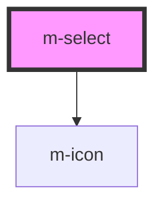

# m-select

<!-- Auto Generated Below -->

## Properties

| Property                    | Attribute                       | Description                                                           | Type                                              | Default                 |
| --------------------------- | ------------------------------- | --------------------------------------------------------------------- | ------------------------------------------------- | ----------------------- |
| `hint`                      | `hint`                          | The hint of the select in full variant                                | `string \| undefined`                             | `undefined`             |
| `hintIconEnd`               | `hint-icon-end`                 | The hint icon for the select in full variant                          | `string \| undefined`                             | `undefined`             |
| `hintIconEndFamilyClass`    | `hint-icon-end-family-class`    | Hint right icon family class                                          | `string \| undefined`                             | `undefined`             |
| `hintIconEndFamilyPrefix`   | `hint-icon-end-family-prefix`   | Hint right icon family class                                          | `string \| undefined`                             | `undefined`             |
| `hintIconStart`             | `hint-icon-start`               | The hint icon for the select in full variant                          | `string \| undefined`                             | `undefined`             |
| `hintIconStartFamilyClass`  | `hint-icon-start-family-class`  | Hint left icon family class                                           | `string \| undefined`                             | `undefined`             |
| `hintIconStartFamilyPrefix` | `hint-icon-start-family-prefix` | Hint left icon family class                                           | `string \| undefined`                             | `undefined`             |
| `iconEnd`                   | `icon-end`                      | The end icon for the select                                           | `string \| undefined`                             | `undefined`             |
| `iconEndFamilyClass`        | `icon-end-family-class`         | Right icon family class                                               | `string \| undefined`                             | `undefined`             |
| `iconEndFamilyPrefix`       | `icon-end-family-prefix`        | Right icon family class                                               | `string \| undefined`                             | `undefined`             |
| `iconMiddle`                | `icon-middle`                   | The middle icon for the select                                        | `string \| undefined`                             | `undefined`             |
| `iconMiddleFamilyClass`     | `icon-middle-family-class`      | Middle icon family class                                              | `string \| undefined`                             | `undefined`             |
| `iconMiddleFamilyPrefix`    | `icon-middle-family-prefix`     | Middle icon family class                                              | `string \| undefined`                             | `undefined`             |
| `iconStart`                 | `icon-start`                    | The start icon for the select                                         | `string \| undefined`                             | `undefined`             |
| `iconStartFamilyClass`      | `icon-start-family-class`       | Left icon family class                                                | `string \| undefined`                             | `undefined`             |
| `iconStartFamilyPrefix`     | `icon-start-family-prefix`      | Left icon family class                                                | `string \| undefined`                             | `undefined`             |
| `isDisabled`                | `is-disabled`                   | The select is disabled                                                | `boolean`                                         | `false`                 |
| `isLoading`                 | `is-loading`                    | Flag for loading state.                                               | `boolean`                                         | `false`                 |
| `label`                     | `label`                         | The label of the select in full variant                               | `string \| undefined`                             | `undefined`             |
| `labelExtractor`            | --                              | Callback to extract the label from the option                         | `(item: any) => string`                           | `(item) => item?.label` |
| `labelIcon`                 | `label-icon`                    | Icon for the label text                                               | `string`                                          | `'info-circle'`         |
| `labelIconFamilyClass`      | `label-icon-family-class`       | Icon label family class                                               | `string \| undefined`                             | `undefined`             |
| `labelIconFamilyPrefix`     | `label-icon-family-prefix`      | Icon label family class                                               | `string \| undefined`                             | `undefined`             |
| `layoutDirection`           | `layout-direction`              | Change the layout direction to put the label on top or left of select | `"horizontal" \| "vertical"`                      | `'vertical'`            |
| `mId` _(required)_          | `m-id`                          | Id of the select                                                      | `string`                                          | `undefined`             |
| `name`                      | `name`                          | The name of the input                                                 | `string \| undefined`                             | `undefined`             |
| `options`                   | --                              | The select options                                                    | `Record<string, unknown>[]`                       | `[]`                    |
| `selectedOption`            | --                              | The value selected of the component                                   | `undefined \| { [x: string]: unknown; }`          | `undefined`             |
| `theme`                     | `theme`                         | The theme of the select                                               | `string \| undefined`                             | `undefined`             |
| `valueExtractor`            | --                              | Callback to extract the value from the option                         | `(item: any) => string \| number`                 | `(item) => item?.value` |
| `variant`                   | `variant`                       | The variant of the select                                             | `"full" \| "prime" \| "transparent" \| undefined` | `'prime'`               |

## Events

| Event     | Description                               | Type               |
| --------- | ----------------------------------------- | ------------------ |
| `mBlur`   | Emitted when blur the input               | `CustomEvent<any>` |
| `mChange` | Emitted when the select value has changed | `CustomEvent<any>` |

## Dependencies

### Depends on

- [m-icon](../m-icon)

### Graph

----------------------------------------------

*Built with [StencilJS](https://stenciljs.com/)*
